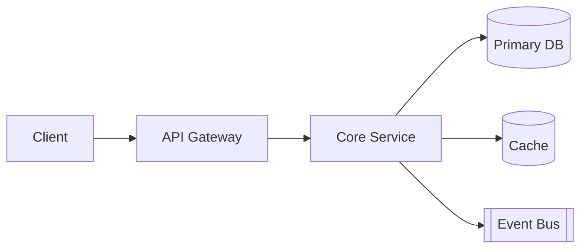
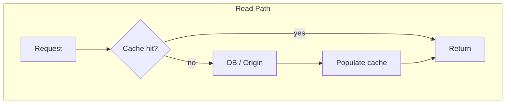
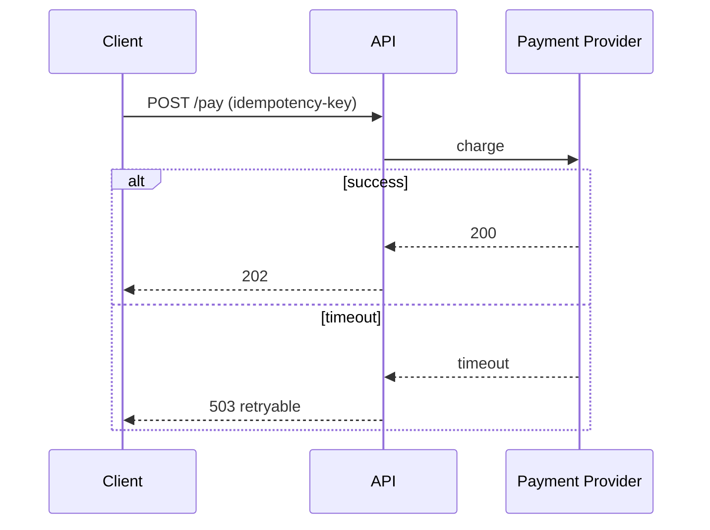
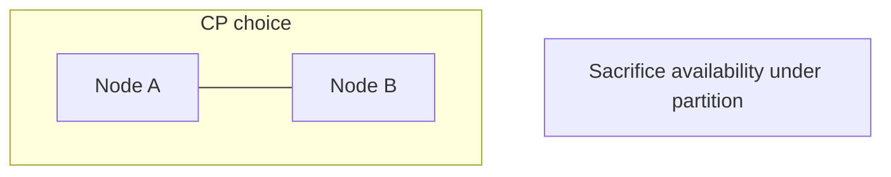
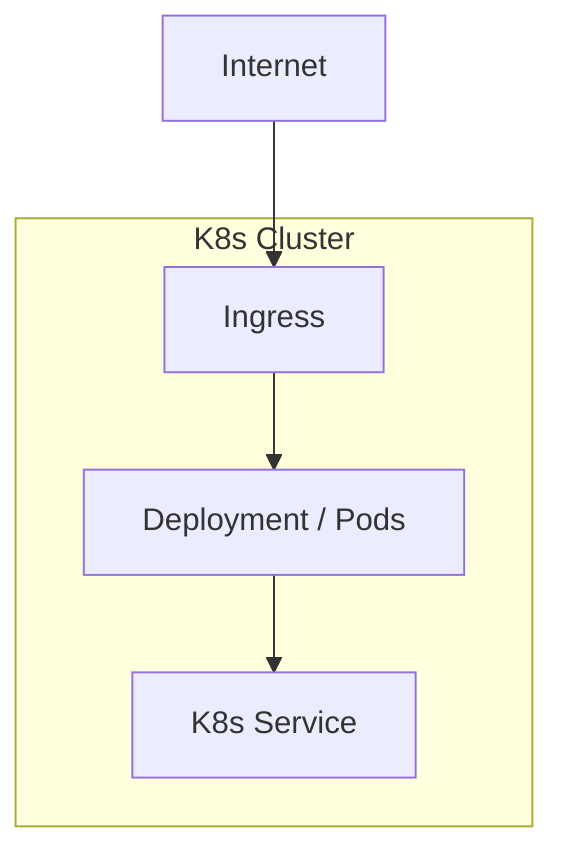
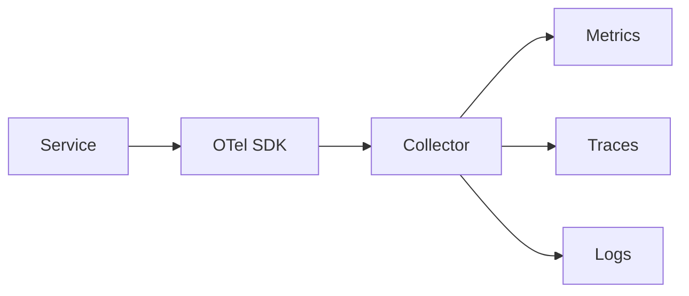
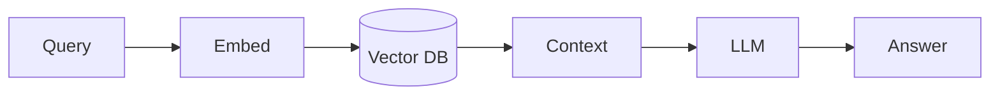
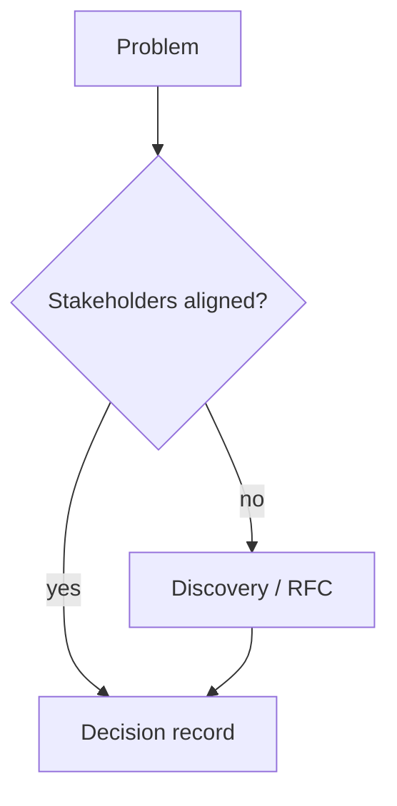

# Diagram Patterns for Handbook Topics

## How Many Diagrams

| Topic type | Target count | Typical types |
|------------|--------------|---------------|
| Leadership / interview-meta | 0–1 | flow, matrix |
| Language/patterns | 1–2 | class, sequence |
| Data/cache/DB | 2–3 | ER, read/write path, replication |
| Distributed/messaging | 2–4 | topology, sequence, timeline |
| Case study | 3–4 | context, container, sequence, data model |
| Security | 2 | trust boundary, auth flow |

Store each in `diagrams/<purpose>.md`. Embed in README via link or `<!-- include -->` style reference.

## Caption Rule

Every diagram file starts with:

```markdown
# <Title>

**Supports decision:** <one sentence — e.g., "choose sync vs async write path">
```

## Mermaid Conventions

- Use `flowchart TB` or `LR` for architecture; `sequenceDiagram` for request paths; `erDiagram` for data; `stateDiagram-v2` for lifecycle.
- **Node IDs**: camelCase or underscores, no spaces (`orderService` not `Order Service`).
- **Subgraphs**: `subgraph api [API Layer]` — label in brackets with spaces OK.
- Avoid deprecated `graph TD`; prefer `flowchart`.
- For C4-ish views, use nested `subgraph` rather than unsupported C4 syntax.

## Pattern Catalog

### 1. System context (case studies, microservices)



### 2. Read vs write path (caching, DB, search)



### 3. Sequence — happy path + failure (payments, API)



### 4. Consistency / CAP (distributed)



### 5. Deployment (K8s, Docker, AWS)



### 6. Observability pipeline



### 7. RAG pipeline (AI chapters)



### 8. Leadership — decision flow (optional)



## ASCII Fallback

Use when: terminal-only README, state machine with few states, or user requests no Mermaid.

```
Client -> API -> Service -> DB
              \-> Cache (TTL)
              \-> Queue -> Worker
```

Keep ≤12 lines; label hot path with `*`.

## Case Study Diagram Pack (minimum set)

For `case-studies/*` create up to four files:

1. `context.md` — actors and external systems
2. `components.md` — internal boxes and data stores
3. `core-flow.md` — sequence for critical user journey
4. `scale.md` — sharding, CDN, or fan-out (if applicable)

Pair with **capacity napkin math** in README (not in diagram file).

## Validation

Before commit, mentally check:

- All nodes referenced in edges exist
- No overlapping `subgraph` IDs
- Sequence `alt/else/end` balanced
- Spelling in participant names matches README
