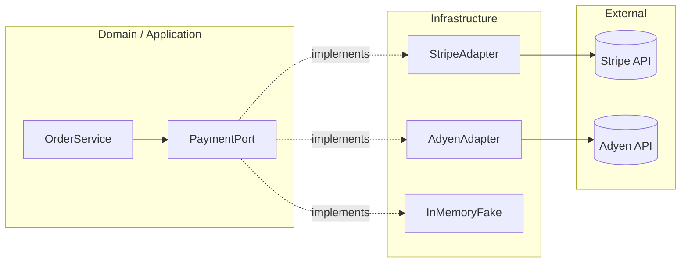

# Dependency Inversion — Payment Port

**Supports decision:** Where to place interfaces so domain logic stays testable and PSP migration does not rewrite `OrderService`.

**CI hook:** Dependency rule — `domain` must not import `infra` or vendor SDK packages; only `infra` references adapters.
