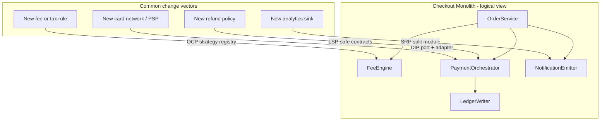

# SOLID — Change Pressure on Checkout

**Supports decision:** Which principle applies when a new fee rule, PSP, or read model lands—without redrawing the whole system.

**Reading the diagram:** Each arrow is a *type* of future change. Map your roadmap item to a letter (SRP/O/L/I/D) before choosing patterns from Chapter 02.
