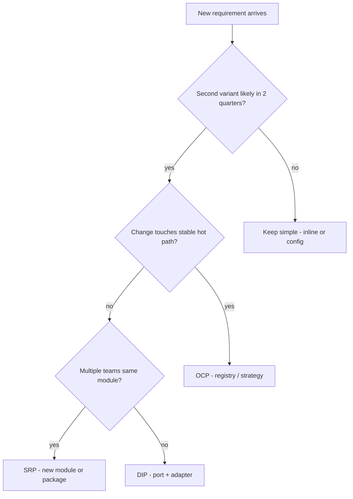

# When to Introduce Abstraction

**Supports decision:** OCP/DIP now vs YAGNI—avoid speculative layers on the critical path.

**Caption:** “Second variant” means a committed roadmap item (second PSP, second fee jurisdiction)—not architect intuition alone.
