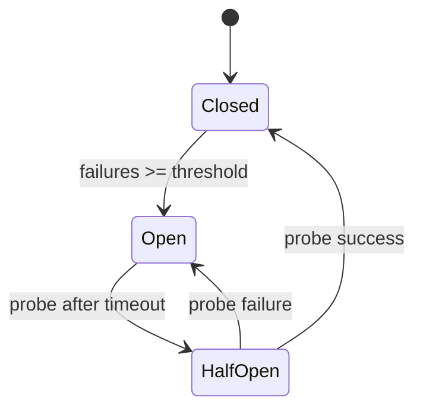

# Chapter 02: Design Patterns (GoF + Enterprise)

> **One line:** Patterns are **shared names for recurring collaborations**—so design reviews move fast and legacy code can evolve without everyone inventing new vocabulary.

## Why this matters in production

A notification platform sends order confirmations over email, SMS, and push. Product adds WhatsApp in one quarter, then a partner-specific webhook channel. Without a **Strategy** (or registry) for `ChannelSender`, engineers edit a 2,000-line `NotificationService` and regress SMS throttling. Meanwhile, the checkout service still calls a 2014 SOAP fraud API through copy-pasted HTTP code; every PSP migration rewrites `OrderService`. Stakeholders feel **slow delivery**, **fragile integrations**, and **on-call noise** when a downstream timeout takes down checkout.

GoF patterns plus enterprise habits (**ports/adapters**, **circuit breaker**, **bulkhead**) give Staff+ engineers a **review vocabulary**: “extract Strategy,” “Adapter at the boundary,” “breaker on the fraud client.” That vocabulary connects directly to [Chapter 01: SOLID](../01-solid-and-core-engineering-principles/README.md)—Strategy supports OCP, Adapter + ports support DIP, and circuit breakers address **partial failure** before you reach [Chapter 20: Distributed Systems Fundamentals](../20-distributed-systems-fundamentals/README.md).

## Core ideas

Patterns are not a shopping list. They are **solutions to forces** you already feel: varying algorithms, wrapping legacy APIs, decoupling publishers from subscribers, or stopping cascade failures.

### GoF map — what architects still name in reviews

| Category | Examples | Production “when you hear it” |
|----------|----------|--------------------------------|
| **Creational** | Factory Method, Abstract Factory, Builder, Singleton | Object creation is complex, variant families (e.g., `Exporter` per format), or you must hide construction from policy code |
| **Structural** | Adapter, Facade, Decorator, Proxy, Composite | Integrate **legacy or third-party** shapes, add cross-cutting behavior (metrics, auth), or unify messy subsystems behind one port |
| **Behavioral** | Strategy, Observer, Template Method, Command, State | **Swappable algorithms**, event fan-out, workflow skeletons with hooks, undo/audit, lifecycle with explicit transitions |

**Staff+ filter:** In interviews and RFCs, **Strategy, Adapter, Factory, Observer, Decorator, Template Method, and State** cover most brownfield discussions. Know the rest to read old code—not to sprinkle names in greenfield services.

### Strategy — swappable policy without a growing `switch`

**Intuition:** Encapsulate a family of algorithms behind one interface; the context picks an implementation at runtime (config, merchant tier, country).

**Production anchor:** Fraud scoring (`RulesEngine` vs ML client), fee rules (see [Chapter 01](../01-solid-and-core-engineering-principles/README.md)), notification channels, shipping calculators.

| | Strategy registry | Giant `switch` / if-chain |
|---|---|---|
| When | N+1 variants, additive product roadmap | 1–2 variants, stable for 12+ months |
| Risk | Discovery: which implementation ran? | Merge conflicts, untested branches |
| Ops signal | Feature flags select strategy id | Incidents from “forgot to update branch for EU” |

**Pair with:** [Open/Closed](../01-solid-and-core-engineering-principles/README.md#openclosed-ocp) — new channel = new type, not edit central dispatcher.

### Adapter and ports/adapters (hexagonal)

**Intuition:** **Adapter** translates an incompatible interface (legacy SOAP, vendor SDK) into what your domain expects. **Ports/adapters** (hexagonal) place **all** such translations on the outside; domain speaks only **ports**.

```
  +------------------+     implements      +------------------+
  |  OrderService    | -----------------> |   PaymentPort    |  port (in domain)
  +------------------+                     +------------------+
                                                    ^
                                                    | implements
                                          +---------+----------+
                                          |   StripeAdapter    |  adapter (infra)
                                          +--------------------+
```

**Production anchor:** PSP swap, mainframe ledger bridge, CRM sync, “strangler” wrapper around old monolith HTTP.

**vs Facade:** Facade **simplifies** a subsystem you own; Adapter **makes foreign look native**. Don’t Facade-away errors you should surface to callers.

**Legacy evolution:** New capability behind a port; old path kept as `LegacyBillingAdapter` until traffic drains—aligns with strangler fig migrations in [Chapter 17: Microservices](../17-microservices-architecture/README.md).

### Observer and event-driven boundaries

**Intuition:** Subject notifies dependents without knowing their concrete types—**in-process** pub/sub.

**Production anchor:** Domain events inside a modular monolith (`OrderPlaced` → send receipt, update read model, enqueue outbox). At scale, Observer becomes **message bus** ([Chapter 18: Event-Driven Architecture](../18-event-driven-architecture/README.md), [Chapter 19: Kafka](../19-kafka-and-messaging/README.md)).

| | In-process Observer | Kafka topic |
|---|---|---|
| When | Same deployable, transactional consistency needed | Cross-service fan-out, durability, replay |
| Risk | Hidden coupling, sync handler blocks publisher | Duplication, ordering, idempotency |
| Ops signal | Slow request traces through listener chain | Consumer lag, DLQ depth |

**Architect rule:** If failure of a listener must **roll back** the publisher’s transaction, keep it in-process or use outbox—not fire-and-forget Kafka from the request thread.

### Decorator, Proxy, Template Method — cross-cutting and workflows

- **Decorator:** Add behavior around an interface (metrics, caching, retry wrapper) without subclass explosion. Watch **ordering** (cache outside retry vs inside) and observability tags.
- **Proxy:** Control access (lazy load, authz, remote stub). Service mesh sidecars are proxies at infrastructure layer.
- **Template Method:** Fixed skeleton (`settlePayment`) with hooks (`validateRisk`, `captureFunds`). Good for **regulated workflows**; bad when subclasses fight LSP—prefer composition + Strategy for volatile steps.

### Enterprise patterns: circuit breaker (and friends)

**Intuition:** Stop calling a sick dependency after failures exceed a threshold; **fail fast** and optionally probe recovery—protect threads, connection pools, and user-facing latency.

**Production anchor:** Fraud API, geocoding, loyalty points, third-party KYC—anything **non-critical path** or with **fallback** (degraded checkout, cached score).



| State | Caller experience | Ops focus |
|-------|-------------------|-----------|
| Closed | Normal | Error rate on dependency |
| Open | Fast failure / fallback | Breaker open metric; dependency SLO |
| HalfOpen | Limited trial traffic | Probe success rate |

**Not a substitute for:** timeouts, retries with jitter, bulkheads, or idempotent writes ([Chapter 23: Idempotency and Sagas](../23-idempotency-sagas-and-distributed-transactions/README.md)). Breakers **contain** damage; they don’t fix duplicate charges.

**Libraries:** Resilience4j (Java), `sony/gobreaker` (Go), mesh outlier detection—prefer **consistent config** (thresholds, half-open probe count) in platform standards ([Chapter 31: Architecture Governance](../31-architecture-governance/README.md)).

### Pattern selection vs pattern fever

| Signal | Reasonable pattern | Smell |
|--------|-------------------|--------|
| Second PSP on roadmap | `PaymentPort` + adapters | Abstract factory for one provider |
| Five notification channels | Strategy registry | Singleton “God” dispatcher |
| Legacy inventory API | Adapter + anti-corruption layer | Rewriting domain to match vendor DTOs |
| Fraud API timeouts spike checkout | Circuit breaker + timeout + fallback score | Infinite retry in request path |

**YAGNI** still wins: patterns earn their file count when a **second variant** or **integration boundary** is real—not when a blog post said so.

### Patterns in legacy evolution (review vocabulary)

1. **Identify seam** — port boundary where tests can pin behavior (charge, notify, score).
2. **Adapter first** — wrap legacy; don’t big-bang rewrite domain model.
3. **Strangler** — route % traffic to new implementation behind same port.
4. **Replace Strategy** — swap algorithm (rules engine) before replacing data store.
5. **Document in ADR** — which pattern, rejected alternative, rollback ([Chapter 31](../31-architecture-governance/README.md)).

## When to use / when to avoid

**Use when:**

- Product commits to **multiple variants** of the same behavior (channels, fees, fraud tiers).
- **Third-party or legacy** APIs must not leak types into domain.
- Downstream instability causes **cascade latency**; path has fallback or is non-critical.
- Teams need **shared language** in design reviews and postmortems.

**Avoid when:**

- One implementation, no roadmap variant — use plain functions and a module.
- Pattern adds **indirection without a test seam** (interface with single impl forever).
- Circuit breaker on **critical path with no fallback** without explicit product sign-off (you only fail faster).
- Observer chain on hot request path without budget (p99 regression).

## How it fails

| Symptom | Likely cause | What to check |
|---------|--------------|---------------|
| “We have Strategy but still edit the dispatcher every sprint” | Registry not wired; strategies call shared mutable state | Who imports whom; pure functions vs shared DB |
| Adapter leaks vendor exceptions into domain | Anti-corruption skipped | Map errors to domain types at boundary |
| Breaker flaps open/closed | Threshold too low, or dependency slow not down | Latency vs error rate; half-open probe rate |
| Breaker open, checkout still slow | Pool exhaustion before breaker trips | Thread dump, connection pool metrics, timeout alignment |
| Events lost or doubled | Observer in-process without outbox; Kafka without idempotency | Transaction boundaries; consumer dedup keys |
| 47 classes for 3 features | Pattern fever / premature Abstract Factory | Count shipped variants last 4 quarters |

**Incident pattern:** Fraud service degrades; checkout retries 3× with no jitter, exhausts HTTP pool, **breaker never opens** because errors are swallowed as `Optional.empty()`. p99 checkout hits 30s. Fix: classify errors, **timeout < client deadline**, breaker + **degraded path** with audit flag; page on `circuit_breaker_state=open` for fraud.

## Architect takeaway

- **Decide:** Which boundaries get **ports** (PSP, ledger, identity) vs in-module **Strategy** (fees, channels) vs **breaker** (optional enrichment). Write the trigger (“second PSP,” “fraud SLO breach”) not “always hexagonal.”
- **Measure:** p99 with breaker open vs closed; adapter error mapping coverage; lead time to add channel/rule; dependency error budget ([Chapter 24: Reliability Engineering](../24-reliability-engineering/README.md)).
- **Document in design review:** Port diagram, strategy selection rules, breaker thresholds/fallback behavior, and **explicit non-use** of patterns (YAGNI).

## Diagrams

- [Overview — GoF to production forces](./diagrams/overview.md)
- [Ports and adapters — hexagonal boundary](./diagrams/ports-adapters.md)
- [Circuit breaker states](./diagrams/circuit-breaker-states.md)
- [Pattern selection — when to introduce indirection](./diagrams/pattern-selection.md)

## Code examples

| Scenario | Java | Go |
|----------|------|-----|
| Strategy — notification channels | [java/StrategyNotificationChannels.java](./java/StrategyNotificationChannels.java) | [go/strategy_notification_channels.go](./go/strategy_notification_channels.go) |
| Ports/adapters — inventory boundary | [java/PortsAdaptersInventory.java](./java/PortsAdaptersInventory.java) | [go/ports_adapters_inventory.go](./go/ports_adapters_inventory.go) |
| Circuit breaker — fraud enrichment call | [java/CircuitBreakerFraudClient.java](./java/CircuitBreakerFraudClient.java) | [go/circuit_breaker_fraud_client.go](./go/circuit_breaker_fraud_client.go) |

**Production note:** Ship **Strategy** when product owns a backlog of channel/rule variants. Ship **ports/adapters** at revenue-critical integrations from day one in monoliths. Add **circuit breakers** when dependency outages or latency tails have caused Sev-2+ in the last two quarters and a defined fallback exists.

## Related topics

- [Chapter 01: SOLID and Core Engineering Principles](../01-solid-and-core-engineering-principles/README.md) — Forces behind Strategy, Adapter, and DIP.
- [Chapter 03: Domain-Driven Design and Bounded Contexts](../03-domain-driven-design-and-bounded-contexts/README.md) — Anti-corruption layers and context boundaries for adapters.
- [Chapter 17: Microservices Architecture](../17-microservices-architecture/README.md) — Strangler, service boundaries, sync vs async.
- [Chapter 20: Distributed Systems Fundamentals](../20-distributed-systems-fundamentals/README.md) — Retries, timeouts, backpressure with breakers.
- [Chapter 24: Reliability Engineering](../24-reliability-engineering/README.md) — SLOs and error budgets for dependency calls.

## Interview preparation

See [interview-questions.md](./interview-questions.md) (25 questions — foundations through Staff+ trade-offs).
