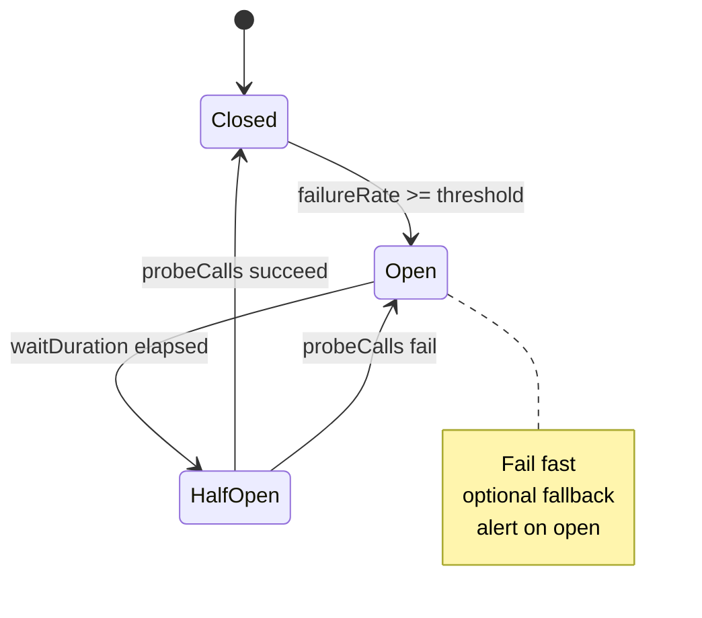

# Circuit Breaker State Machine

**Supports decision:** Configure thresholds, half-open probes, and fallback behavior when a fraud or enrichment dependency degrades.

**Align with timeouts:** Client deadline should be **less than** user-facing SLA; breaker open should return before pool exhaustion—not after 30s of blocked threads.
