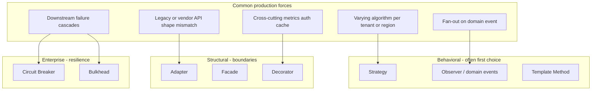

# Design Patterns — Forces to Pattern Families

**Supports decision:** Name the right pattern family in a review (behavioral vs structural) before debating class diagrams.

**Reading the diagram:** Start from the **force** (what hurts in prod), not the pattern name. If the force is “varying policy,” Strategy beats Factory unless you are constructing incompatible families of objects.
