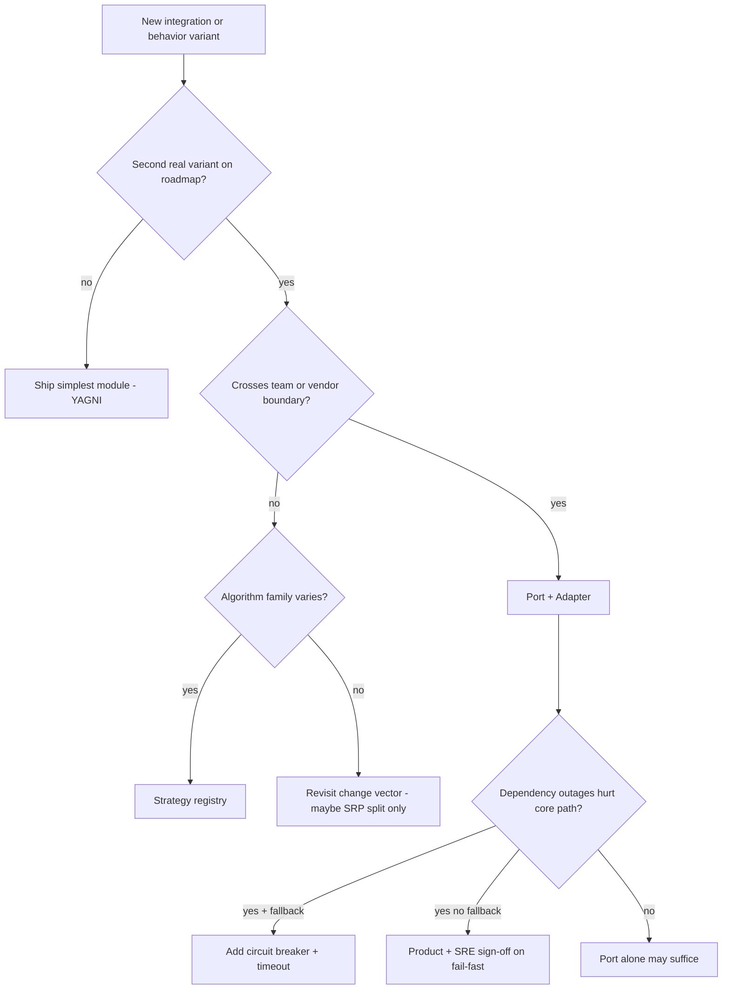

# Pattern Selection — Introduce Indirection?

**Supports decision:** Push back on pattern fever or justify a port/strategy/breaker in the next sprint.

**Caption:** “Second real variant” means committed roadmap or second tenant/region—not architect imagination.
