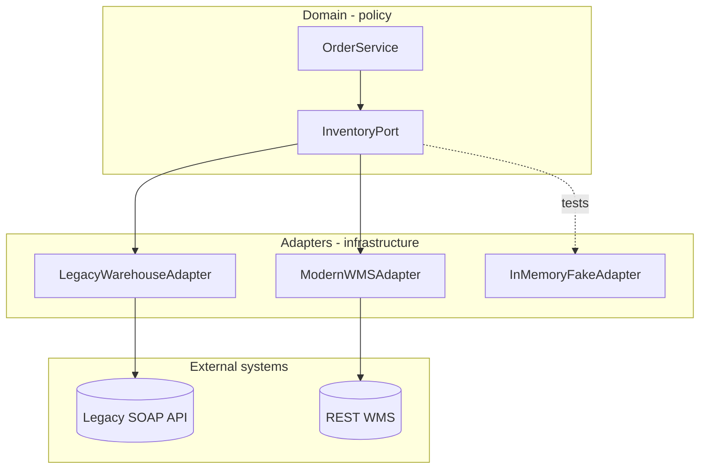

# Ports and Adapters (Hexagonal)

**Supports decision:** Where to draw the boundary so domain logic never imports vendor SDKs—and how strangler migrations swap implementations.

**Migration note:** Route traffic by feature flag or tenant from `LegacyWarehouseAdapter` to `ModernWMSAdapter` while `OrderService` stays unchanged—strangler at the port, not rewrite of checkout.
