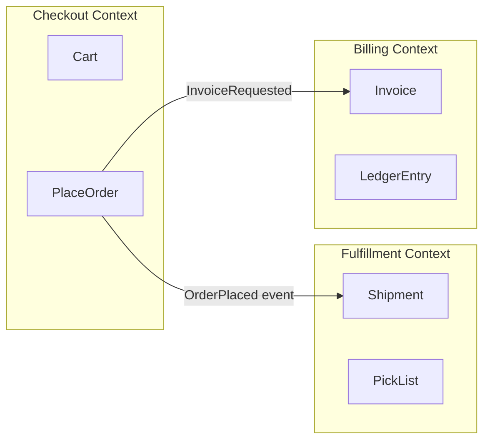

# Chapter 03: Domain-Driven Design and Bounded Contexts

> **One line:** DDD is how you **align language, code, data ownership, and team boundaries** so “Order” in checkout and “Order” in fulfillment don’t silently fight each other in one database.

## Why this matters in production

A marketplace runs checkout, billing, warehouse, and seller payouts. Every team uses the word **“order”** in APIs and tables. Checkout stores `order_status = PAID`; fulfillment reads the same row and interprets `PAID` as “ready to pick”—but checkout meant “authorized, not captured.” Incidents look like **duplicate shipments**, **stuck payouts**, and **impossible reconciliations**. Stakeholders feel **cross-team thrash** and **schema migration paralysis**, not “we need more DDD books.”

Domain-Driven Design (DDD) gives architects a disciplined way to:

- Define **bounded contexts**—explicit models where terms have one meaning.
- Draw **context maps**—how contexts integrate (translate, conform, or share).
- Place **consistency boundaries** (aggregates) and **ownership** before splitting microservices.

Use DDD when **model mismatch** and **organizational coupling** cost more than the modeling ceremony—not when a CRUD admin panel needs a fancy folder structure.

## Core ideas

### Ubiquitous language

**Intuition:** The code, APIs, events, and runbooks use the **same words the business uses** in that slice of the domain—no “`UserDTO`” in checkout and “`BuyerProfile`” in billing unless you mean different concepts.

**Production anchor:** In subscriptions, **“member”** (access) vs **“subscriber”** (billing) vs **“account”** (identity) are often different concepts. Collapsing them into one `users` table forces every team to negotiate renames in one migration.

| | Shared glossary per context | One enterprise data dictionary |
|---|---|---|
| When | Team owns a product slice | Regulated reporting, master data |
| Risk | Drift between contexts | Analysis paralysis, wrong abstractions |
| Ops signal | Postmortems use precise terms | “The order table was wrong” (which order?) |

### Bounded context

**Intuition:** A **boundary** inside which a domain model is **internally consistent**. Outside, assume **different models** and integrate explicitly.

**Production translation:**

- **Checkout context:** `Cart`, `PlaceOrder`, `PaymentAuthorization`—optimistic UX, short-lived state.
- **Fulfillment context:** `Shipment`, `PickList`, `CarrierLabel`—physical constraints, warehouse SLAs.
- **Billing context:** `Invoice`, `LedgerEntry`, `TaxLine`—immutable financial facts.

Each context can have its own **database**, **deployable**, or **package** in a modular monolith. The boundary is the model, not necessarily a process boundary—though Conway’s law often pushes them together.

See [Context map](./diagrams/context-map.md) for relationship types between contexts.

### Bounded context vs microservice

| | Bounded context | Microservice |
|---|---|---|
| **What it is** | Model + language + ownership boundary | Deployable unit with independent runtime |
| **Split trigger** | Conflicting meanings, consistency needs | Scale, team autonomy, failure isolation |
| **Risk** | Big-bang “context” rewrite without shipping | Distributed monolith—chatty sync, shared DB |

**Staff+ rule:** Draw contexts **first**; extract services when **independent scaling, release cadence, or blast radius** justify network boundaries ([Chapter 17: Microservices](../17-microservices-architecture/README.md)). One context per service is a good default; **multiple contexts in one monolith** is often the right MVP.

### Entities, value objects, aggregates

| Building block | Intuition | Production signal |
|----------------|-----------|-------------------|
| **Entity** | Identity matters over time (`OrderId`, `ShipmentId`) | Lifecycle, state machine, audit |
| **Value object** | Defined by attributes; immutable (`Money`, `Address`, `SKU`) | Fewer bugs from shared mutable state |
| **Aggregate** | Cluster of entities with **one root** enforcing invariants | Transaction boundary; concurrency control |

**Aggregate rule of thumb:** One aggregate = **one consistency transaction** in the happy path. Cross-aggregate rules use **eventual consistency** (domain events, sagas—[Chapter 18](../18-event-driven-architecture/README.md), [Chapter 23](../23-idempotency-sagas-and-distributed-transactions/README.md)).

**Example invariant:** `Order` aggregate does not allow `lineItems` to change after `SUBMITTED`; refunds go through `Refund` aggregate referencing `orderId`, not by mutating history in place.

### Domain events

**Intuition:** Something meaningful happened in **past tense** inside a context: `OrderPlaced`, `PaymentCaptured`, `ShipmentDispatched`.

**Use when:** Other contexts need to react without synchronous coupling; you need **audit**, **replay**, or **read model** projection.

**Avoid when:** In-process Observer chains on the hot path without latency budget (see [Chapter 02](../02-design-patterns/README.md)); events as **RPC over Kafka** with no idempotency story.

**Production note:** Publish from the **aggregate’s transaction** via **outbox** when downstream must not see events the DB didn’t commit.

### Anti-corruption layer (ACL)

**Intuition:** A **translation layer** that converts an external model (legacy ERP, partner API, shared “enterprise” schema) into **your context’s language**—so vendor nouns don’t infect domain code.

**When:** Legacy warehouse API returns `WH_REQ_7` statuses; your fulfillment model uses `PickList` / `ReadyToShip`. **Adapter** (Ch. 2) at the wire; **ACL** at the model (mapping, validation, error semantics).

**When to skip:** Greenfield integration where you **own both sides** of the contract and can negotiate a clean API.

### Context map (integration patterns)

Relationships between contexts (not exhaustive):

| Pattern | Meaning | Production example |
|---------|---------|-------------------|
| **Partnership** | Mutual dependency; joint roadmap | Checkout + payments squad co-own auth/capture flow |
| **Customer–supplier** | Upstream sets API; downstream requests | Fulfillment consumes `OrderPlaced` from checkout |
| **Conformist** | Downstream accepts upstream model | Analytics conforms to checkout event schema |
| **Anti-corruption** | Downstream translates upstream | Billing ACL maps checkout `Order` → `InvoiceLine` |
| **Open host service** | Published language for many consumers | `GET /public/v1/products` catalog API |
| **Shared kernel** | Small shared library/schema—use sparingly | Shared `Money` type, not shared `Order` entity |

**Architect takeaway:** Document **who owns** the contract, **versioning**, and **failure mode** for each arrow on the map—not only boxes.

### Strategic vs tactical DDD

| | Strategic (big picture) | Tactical (in code) |
|---|---|---|
| **Focus** | Contexts, map, ownership | Aggregates, entities, domain services |
| **Artifacts** | Context map, RFC boundaries, event storming | Packages, aggregates, repositories |
| **Audience** | Principals, platform, product leads | Feature teams shipping in one context |

Interview loops often mix both: “draw contexts for marketplace checkout” (strategic) and “design `Order` aggregate” (tactical).

### DDD vs SOLID vs patterns

| | DDD (this chapter) | SOLID (Ch. 1) | Patterns (Ch. 2) |
|---|---|---|---|
| **Question** | *Where* do models split? | *How* should modules change? | *What* collaboration structure? |
| **Output** | Context map, ownership | Ports inside a context | Strategy, Adapter, ACL |
| **Failure mode** | 12 microservices day one | Interface soup in one context | Pattern fever |

Apply **SOLID and patterns inside** a bounded context; use **DDD** to decide context lines and integration.

## When to use / when to avoid

**Use when:**

- Multiple teams redefine the **same noun** differently (order, customer, product).
- **Regulatory or financial** invariants need clear ownership (ledger vs cart).
- Legacy or vendor models **leak** into core code (ACL warranted).
- You’re decomposing a monolith and need a **migration map**, not random service cuts.

**Avoid when:**

- Simple CRUD with one team and stable language—**light modules** beat ceremony.
- No access to domain experts—modeling in a vacuum produces **elegant wrong abstractions**.
- “DDD” means **shared database + anemic entities** everywhere—worse than a honest monolith.
- Big-bang **enterprise context map** before shipping one extracted boundary.

## How it fails

| Symptom | Likely cause | What to check |
|---------|--------------|---------------|
| Two services, one `orders` table | Context drawn on org chart, not model | Write ownership; migration coupling |
| Endless translation bugs | Weak ACL; domain imports vendor DTOs | Import rules; mapping tests |
| “Can’t add field without 6 deploys” | Shared kernel too large | What’s truly shared vs duplicated |
| Duplicate events / missed shipments | Aggregate too big or cross-DB “transaction” | Outbox; idempotent consumers |
| Ubiquitous language slides | No product in reviews; engineers rename alone | Glossary per context in RFC template |
| DDD in name only | Anemic domain, logic in “managers” | Where invariants live; aggregate tests |

**Incident pattern:** Fulfillment subscribes to `OrderUpdated` and ships on `status=READY`. Checkout emits `READY` when **payment method is selected**, not when **funds captured**. Fix: rename events to **`PaymentCaptured`** in checkout language; ACL in fulfillment maps to `PickListCreated`; never reuse ambiguous status enums across contexts.

## Architect takeaway

- **Decide:** Context boundaries from **language + write ownership + consistency**, not from “one service per entity table.”
- **Measure:** Cross-context incident rate; lead time for schema change; consumer lag on integration events; % of domain code importing vendor packages.
- **Document in design review:** Context map snippet, **owned aggregates**, integration pattern per neighbor (ACL vs conformist), **non-goals** (“billing does not read checkout cart tables”).

## Diagrams

- [Overview — contexts and data ownership](./diagrams/overview.md)
- [Context map — integration relationships](./diagrams/context-map.md)
- [Anti-corruption — legacy to domain](./diagrams/anti-corruption.md)

## Code examples

| Scenario | Java | Go |
|----------|------|-----|
| Aggregate — order line invariant at submit | [java/OrderAggregate.java](./java/OrderAggregate.java) | [go/order_aggregate.go](./go/order_aggregate.go) |
| Anti-corruption — legacy warehouse status → domain | [java/AntiCorruptionWarehouse.java](./java/AntiCorruptionWarehouse.java) | [go/anti_corruption_warehouse.go](./go/anti_corruption_warehouse.go) |

**Production note:** Model **aggregates** where invariants and contention concentrate (cart submit, inventory hold). Place **ACL** at every legacy or third-party boundary before types cross into domain packages—even in a monolith.

## Related topics

- [Chapter 01: SOLID and Core Engineering Principles](../01-solid-and-core-engineering-principles/README.md) — Module design inside a context.
- [Chapter 02: Design Patterns](../02-design-patterns/README.md) — Adapter and ports; ACL as model-level adapter.
- [Chapter 09: API Design](../09-api-design/README.md) — Public contracts between contexts.
- [Chapter 10: Database Design](../10-database-design-and-data-modeling/README.md) — Schema per context vs shared DB.
- [Chapter 17: Microservices Architecture](../17-microservices-architecture/README.md) — When to extract deployables.
- [Chapter 18: Event-Driven Architecture](../18-event-driven-architecture/README.md) — Events, CQRS, integration.
- [Chapter 23: Idempotency, Sagas, and Distributed Transactions](../23-idempotency-sagas-and-distributed-transactions/README.md) — Cross-context workflows.

## Interview preparation

See [interview-questions.md](./interview-questions.md) (top 10 questions with answers).
