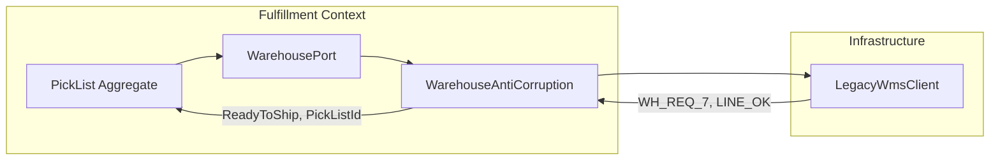

# Anti-Corruption Layer — Legacy to Domain

**Supports decision:** Where translation lives so fulfillment domain never imports `LegacyPickResponse` types.

**Invariant:** Only the ACL package may import legacy DTOs or SDK types. Domain speaks `PickList`, `ShipmentStatus`, and domain errors—not vendor codes.
