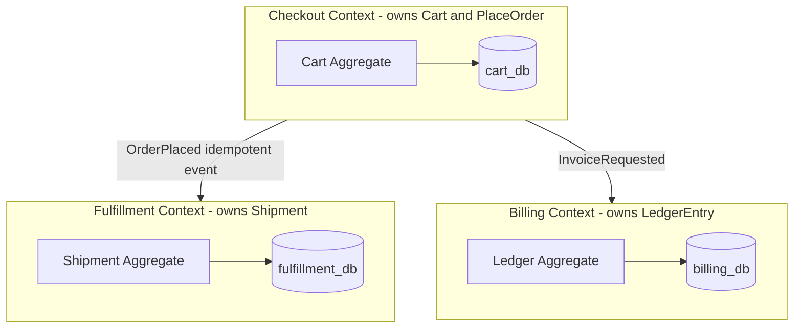

# DDD — Contexts and Data Ownership

**Supports decision:** Where to draw boundaries before splitting services or databases—who owns writes for `Order`, `Shipment`, and `Invoice`.

**Reading the diagram:** Each context has **its own store** in the target state. Integration is **events or APIs**, not shared mutable rows. Shared databases are a **transitional** smell—document the strangler exit.
