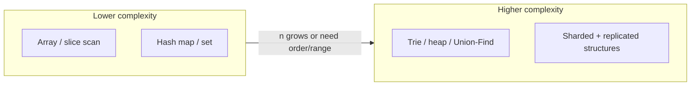

# Time vs Space vs Operability

**Supports decision:** Document rejected structures in an ADR when p99 or heap size is the constraint.

| Force | Cheaper time | Cheaper space | Ops cost |
|-------|--------------|---------------|----------|
| Session store | Hash + LRU O(1) | TTL only, no order | Eviction policy tuning |
| Top-K trending | Min-heap size k | Exact sort O(n log n) | Heap drift on ties |
| Rate limit | Sliding window deque | Fixed window counter | Clock skew at boundary |
| Fraud rings | Union-Find | Pairwise compare O(n²) | Explainable clusters |
| Search suggest | Trie + rank | Full scan prefix | Refresh on catalog churn |
