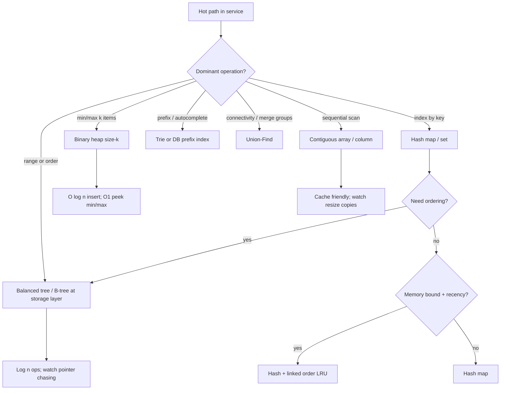

# Choosing a Structure for a Hot Path

**Supports decision:** Pick the container that matches dominant operations—not the one you used last sprint.

```mermaid
flowchart TD
  start[Hot path in service] --> q1{Dominant operation?}

  q1 -->|index by key| hash[Hash map / set]
  q1 -->|range or order| tree[Balanced tree / B-tree at storage layer]
  q1 -->|min/max k items| heap[Binary heap size-k]
  q1 -->|prefix / autocomplete| trie[Trie or DB prefix index]
  q1 -->|connectivity / merge groups| uf[Union-Find]
  q1 -->|sequential scan| array[Contiguous array / column]

  hash --> h1{Need ordering?}
  h1 -->|yes| tree
  h1 -->|no| h2{Memory bound + recency?}
  h2 -->|yes| lru[Hash + linked order LRU]
  h2 -->|no| hashOk[Hash map]

  tree --> t1[Log n ops; watch pointer chasing]
  heap --> hp1[O log n insert; O1 peek min/max]
  array --> ar1[Cache friendly; watch resize copies]
```
