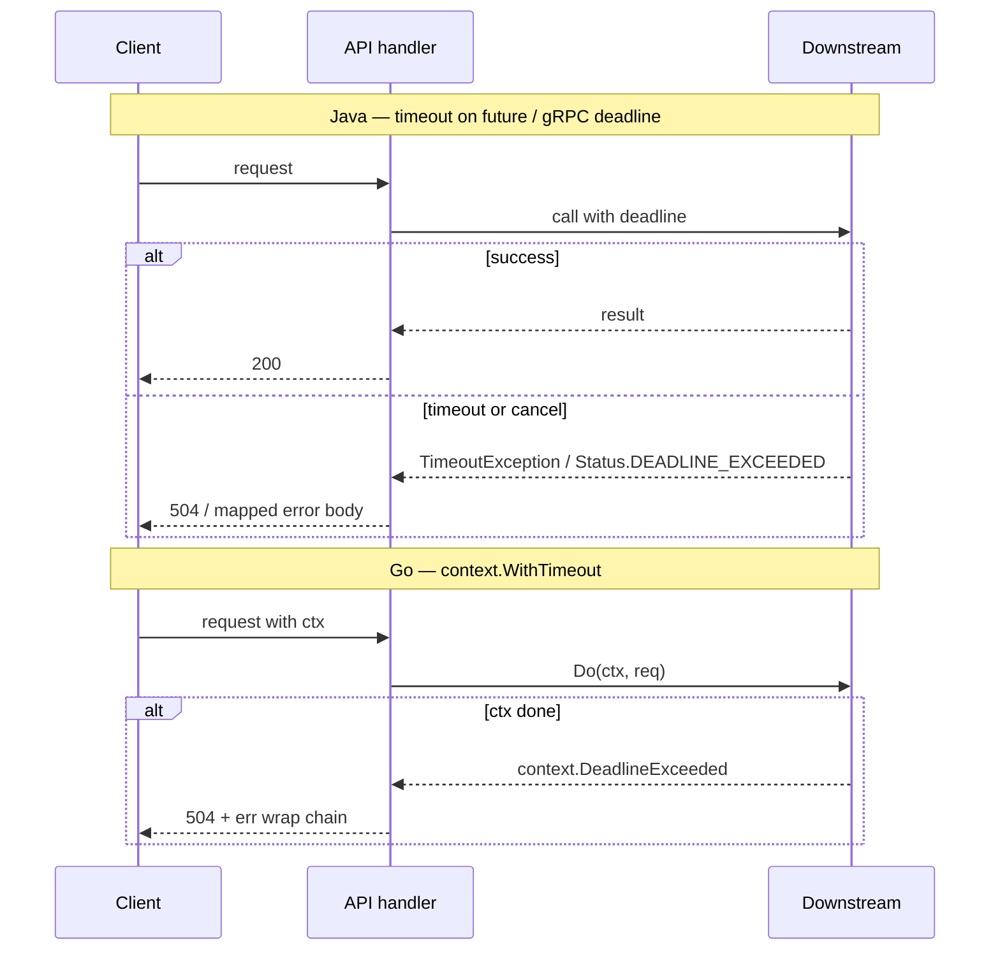

# Error and Cancellation Propagation

**Supports decision:** whether to use exceptions across a module boundary, how to map errors at gRPC/HTTP layers, and where deadlines must be enforced.

**Caption:** Java often centralizes failure as thrown types; Go returns `error` and uses `context` for cancellation. **Map at the edge**—do not leak internal exception names or `sql.ErrNoRows` verbatim to clients.
