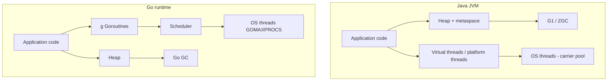

# Java vs Go — Runtime and Concurrency Model

**Supports decision:** sizing thread pools / `GOMAXPROCS`, choosing virtual threads vs platform threads, and setting per-instance concurrency caps.

**Caption:** Java stacks are often larger (platform threads) or mounted on carriers (virtual threads); Go goroutines start small and grow. Both multiplex onto OS threads—**blocking syscalls and locks** still matter for tail latency.
