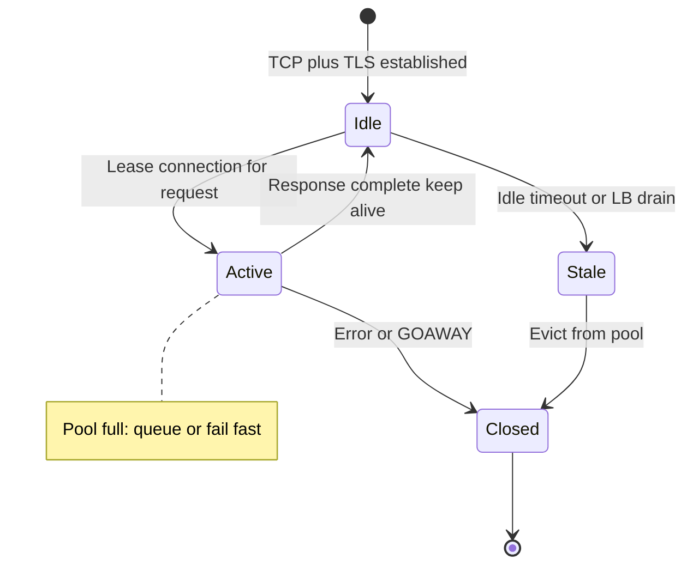

# Networking and HTTP — Connection Pool Lifecycle

**Supports decision:** When to increase pool size vs fix stale connections vs reduce per-request clients.

```mermaid
stateDiagram-v2
  [*] --> Idle: TCP plus TLS established
  Idle --> Active: Lease connection for request
  Active --> Idle: Response complete keep alive
  Active --> Closed: Error or GOAWAY
  Idle --> Stale: Idle timeout or LB drain
  Stale --> Closed: Evict from pool
  Closed --> [*]

  note right of Active
    Pool full: queue or fail fast
  end note
```
