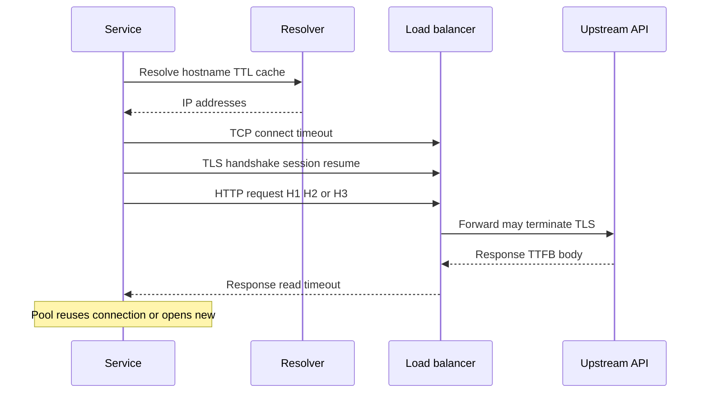

# Networking and HTTP — Request Path Overview

**Supports decision:** Where latency and failure inject (DNS, handshake, pool wait) before blaming application code.

```mermaid
sequenceDiagram
  participant App as Service
  participant DNS as Resolver
  participant LB as Load balancer
  participant Up as Upstream API

  App->>DNS: Resolve hostname TTL cache
  DNS-->>App: IP addresses
  App->>LB: TCP connect timeout
  App->>LB: TLS handshake session resume
  App->>LB: HTTP request H1 H2 or H3
  LB->>Up: Forward may terminate TLS
  Up-->>LB: Response TTFB body
  LB-->>App: Response read timeout
  Note over App: Pool reuses connection or opens new
```
