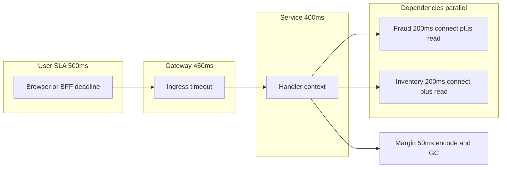

# Networking and HTTP — Timeout Budget

**Supports decision:** How to split connect vs read vs user-facing deadline so retries do not exceed SLA.

**Caption:** Each inner box must finish before its parent; retries and hedging consume the same budget unless explicitly excluded in the design doc.
