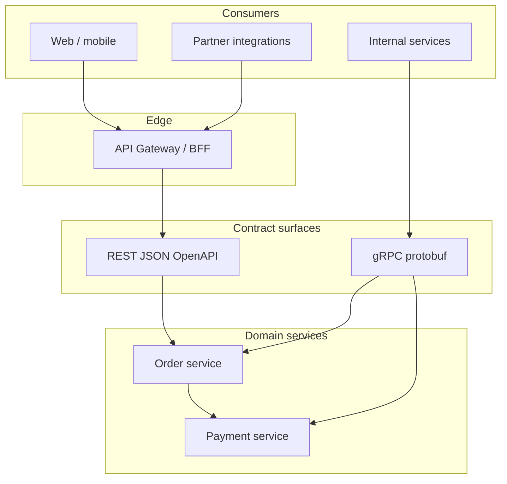

# API Design — REST vs gRPC Overview

**Supports decision:** Choose public HTTP/JSON vs internal binary RPC based on consumer, evolution speed, and operability—not team preference alone.

**Caption:** Partners and browsers hit versioned REST at the gateway; service-to-service calls use gRPC where schema discipline and streaming matter. Both paths should share domain nouns and error semantics even when wire formats differ.
