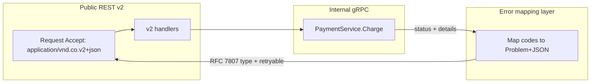
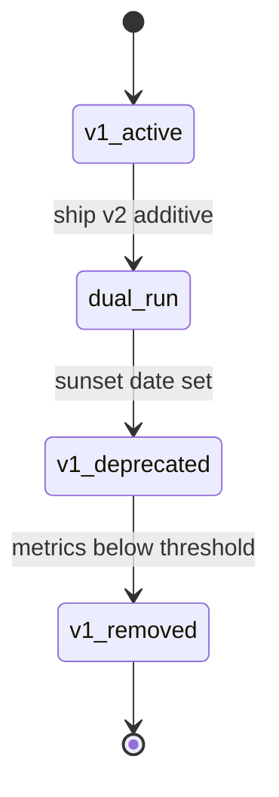

# Versioning and Error Propagation

**Supports decision:** Pick URL/header versioning for public REST and map internal failures to stable, machine-readable client errors.

**Caption:** Version states are operational commitments—monitor traffic share per version before removal. Never leak stack traces or vendor codes across the public boundary.
