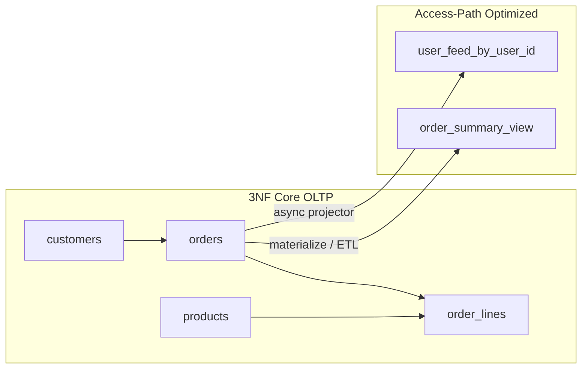
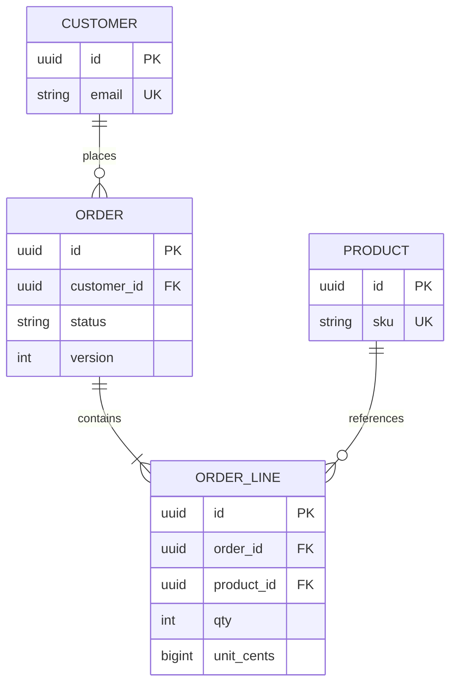

# Normalization vs Access Paths

**Supports decision:** Whether to normalize for write integrity or denormalize for read latency—and where each model should live.

```mermaid
flowchart LR
  subgraph normalized [3NF Core OLTP]
    orders[orders]
    order_lines[order_lines]
    products[products]
    customers[customers]
  end

  subgraph access [Access-Path Optimized]
    order_summary[order_summary_view]
    feed[user_feed_by_user_id]
  end

  orders --> order_lines
  products --> order_lines
  customers --> orders
  orders -->|materialize / ETL| order_summary
  orders -->|async projector| feed
```

```mermaid
erDiagram
  CUSTOMER ||--o{ ORDER : places
  ORDER ||--|{ ORDER_LINE : contains
  PRODUCT ||--o{ ORDER_LINE : references

  CUSTOMER {
    uuid id PK
    string email UK
  }
  ORDER {
    uuid id PK
    uuid customer_id FK
    string status
    int version
  }
  ORDER_LINE {
    uuid id PK
    uuid order_id FK
    uuid product_id FK
    int qty
    bigint unit_cents
  }
  PRODUCT {
    uuid id PK
    string sku UK
  }
```
