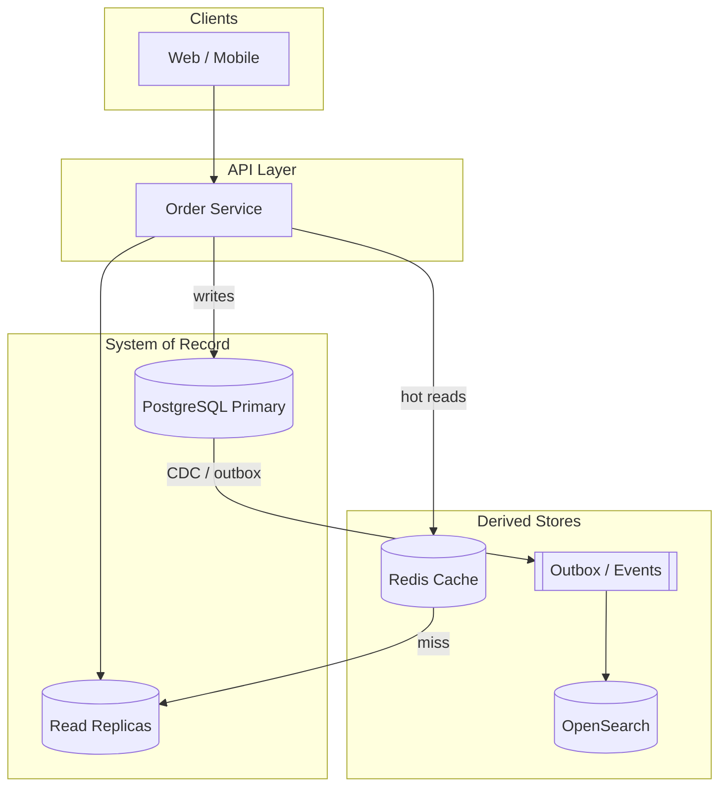

# Database Design — Storage in the Request Path

**Supports decision:** Where the system of record lives relative to cache, search, and events—and what must stay ACID on the critical path.

```mermaid
flowchart TB
  subgraph clients [Clients]
    web[Web / Mobile]
  end

  subgraph api [API Layer]
    svc[Order Service]
  end

  subgraph truth [System of Record]
    pg[(PostgreSQL Primary)]
    pgro[(Read Replicas)]
  end

  subgraph derived [Derived Stores]
    cache[(Redis Cache)]
    search[(OpenSearch)]
    outbox[[Outbox / Events]]
  end

  web --> svc
  svc -->|writes| pg
  svc -->|hot reads| cache
  cache -->|miss| pgro
  svc --> pgro
  pg -->|CDC / outbox| outbox
  outbox --> search
```
