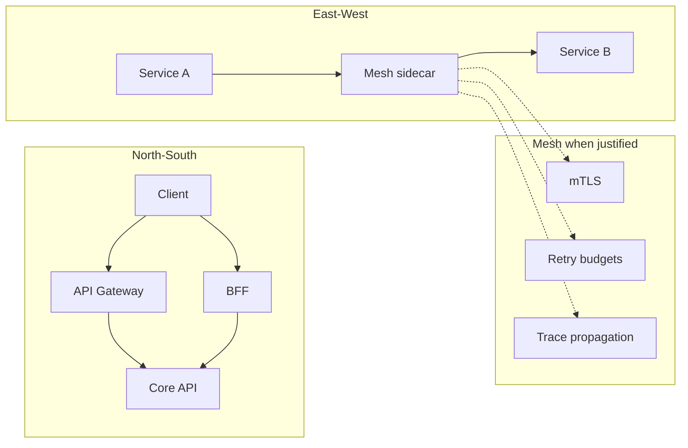

# Microservices — Gateway, BFF, and Mesh

**Supports decision:** where to terminate TLS, auth, and routing (gateway) vs shape responses per client (BFF) vs enforce east-west policy (mesh) without duplicating all three on day one.

