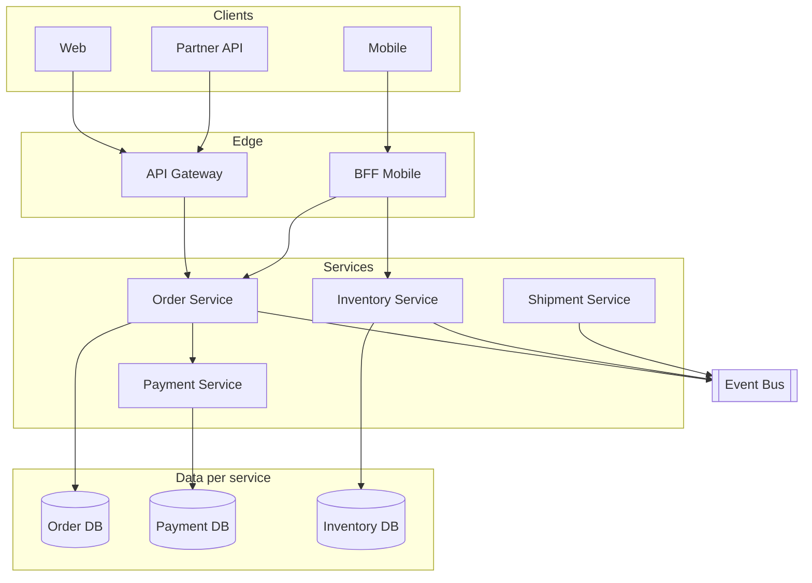

# Microservices — Topology Overview

**Supports decision:** whether each capability gets its own deployable, datastore, and async boundary—or stays in a modular monolith until pain justifies network cost.

