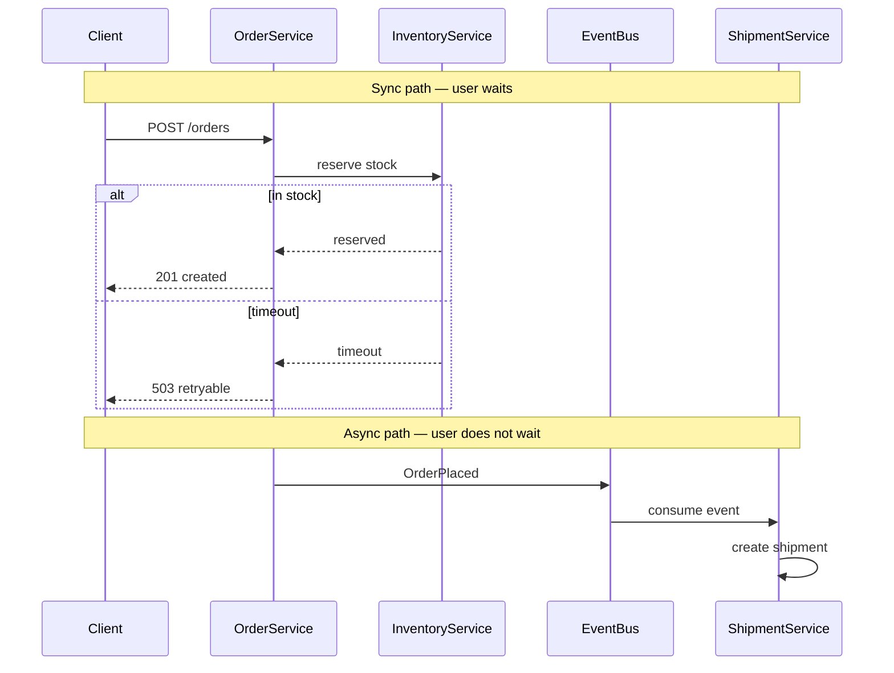

# Microservices — Sync Chain vs Event Integration

**Supports decision:** when checkout may block on inventory (sync) vs when fulfillment should react to `OrderPlaced` (async) without lengthening the user-facing path.

