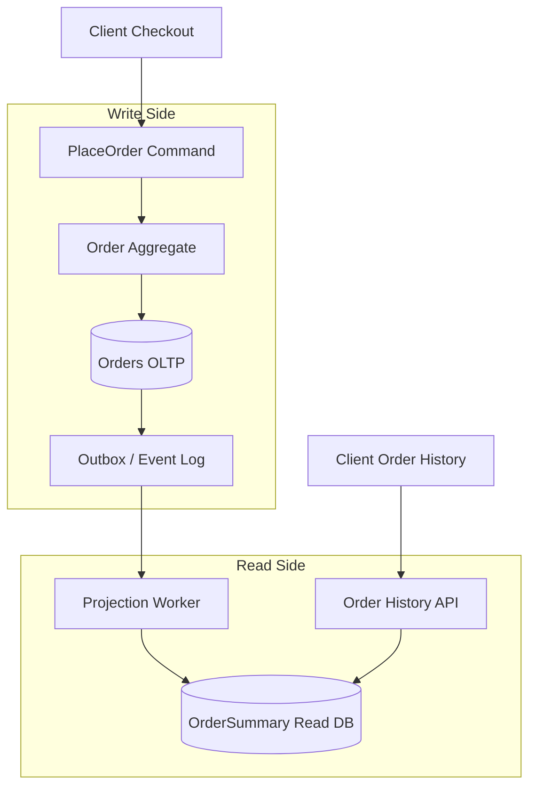

# CQRS — Command and Query Paths

**Supports decision:** When to split write models from read models and how projections stay eventually consistent.

**Caption:** Writes enforce **invariants** on the OLTP model; reads hit a **denormalized** store optimized for list/search. Lag between write and read is an explicit **SLA** (e.g., &lt;2 s p99), not a surprise.
