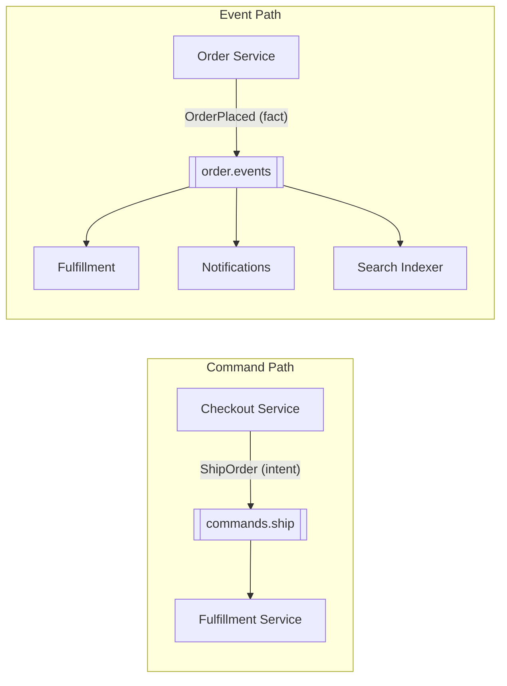

# Events vs Commands

**Supports decision:** Whether a message should be imperative (one handler) or a past-tense fact (many subscribers).

| | Command | Event |
|---|---------|-------|
| **Semantics** | “Do this” | “This happened” |
| **Routing** | Often point-to-point / single consumer group | Pub/sub; 0..N subscribers |
| **Failure** | Caller may retry; handler must be idempotent | Publisher does not know subscribers |
| **Coupling** | Sender knows capability name | Sender knows only its own state change |
| **Example** | `ReserveInventory` to inventory service | `OrderPlaced` after commit |

**Caption:** Prefer **events** for cross-context integration after your aggregate commits; use **commands** inside a context or when you need a directed request with a single accountable handler.
