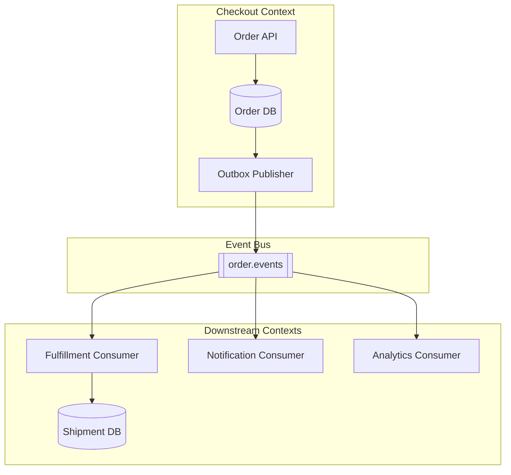

# Event-Driven Architecture — Topology Overview

**Supports decision:** Where to place the broker, which services publish vs subscribe, and where authoritative state still lives.

**Caption:** Checkout remains **write authority** for orders; fulfillment owns shipments. The bus carries **facts** (`OrderPlaced`); consumers are **idempotent** and own their side effects.
