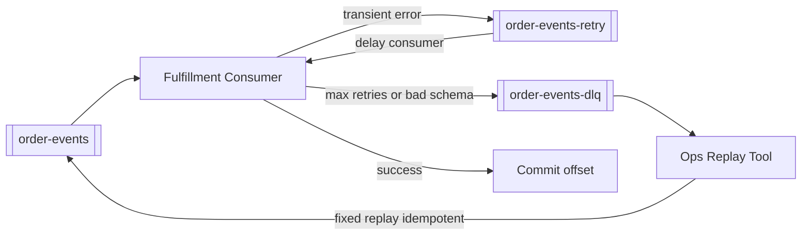

# Ordering, Retry, and DLQ

**Supports decision:** Define retry budget and DLQ routing so poison messages do not block the whole partition indefinitely.

**Caption:** Main consumer advances lag; **DLQ** isolates poison pills. Replay requires **idempotency** and audit—never blind mass re-publish without dedup keys.
