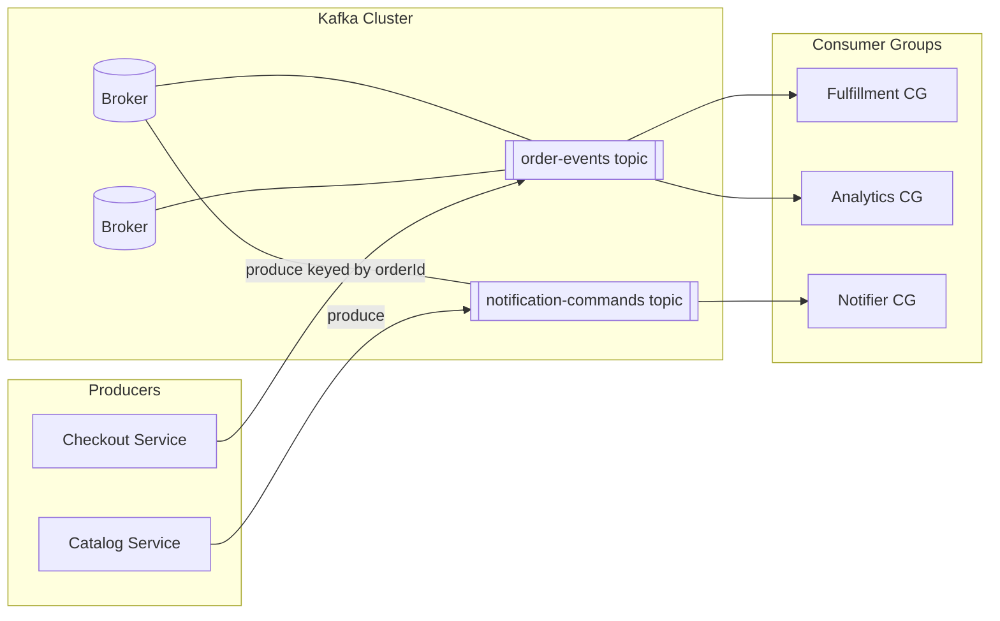

# Kafka and Messaging — Architecture Overview

**Supports decision:** Choose log-based Kafka when multiple independent consumers need durable replay vs a delete-on-ack work queue.

**Caption:** One topic fan-out to **multiple consumer groups**—each group tracks its own offsets. Fulfillment lag does not block analytics if each group scales independently (subject to partition count).
