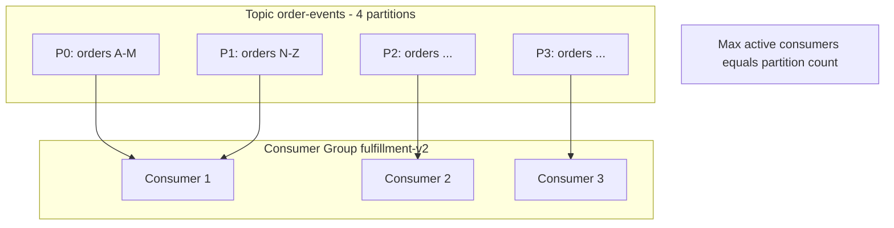
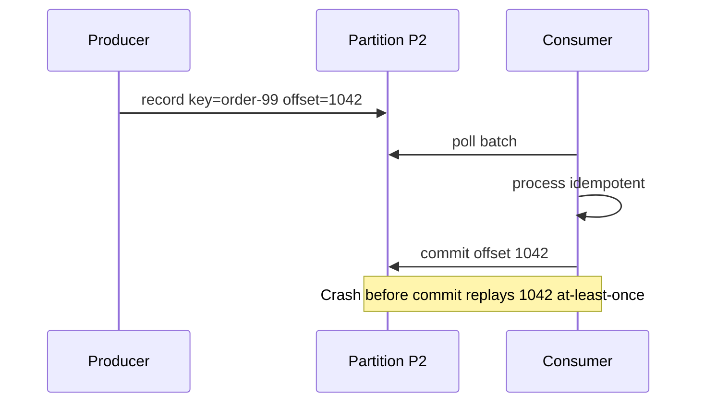

# Partitions and Consumer Groups

**Supports decision:** Size partitions and consumer instances so parallelism matches throughput without breaking per-key ordering.

**Caption:** Partition key `orderId` hashes to one partition—**order-99** events stay ordered. Commit **after** durable side effect to avoid silent loss; expect **replay** on failure.
