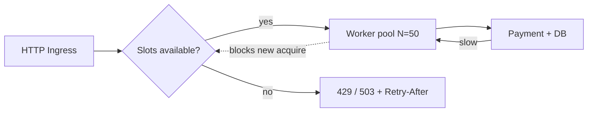

# Backpressure — Bounded In-Flight Work

**Supports decision:** shed or queue load at the boundary when downstream cannot keep pace—before memory, thread pools, or brokers collapse.

```mermaid
flowchart LR
  ingress[HTTP Ingress] --> gate{Slots available?}
  gate -->|yes| pool[Worker pool N=50]
  gate -->|no| reject[429 / 503 + Retry-After]
  pool --> downstream[Payment + DB]
  downstream -->|slow| pool
  pool -.->|blocks new acquire| gate
```
