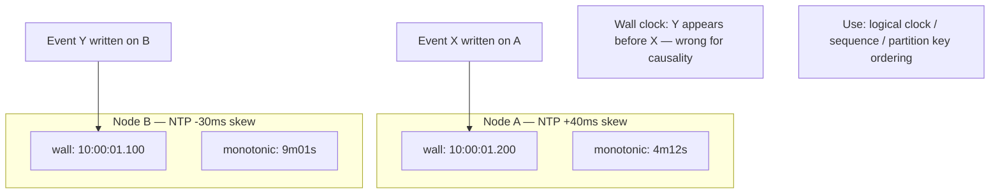

# Clocks and Ordering Across Nodes

**Supports decision:** never use wall-clock timestamps alone for cross-node causality; prefer monotonic budgets, version vectors, or broker ordering keys.

```mermaid
flowchart TB
  subgraph nodeA [Node A — NTP +40ms skew]
    ta[wall: 10:00:01.200]
    ma[monotonic: 4m12s]
  end

  subgraph nodeB [Node B — NTP -30ms skew]
    tb[wall: 10:00:01.100]
    mb[monotonic: 9m01s]
  end

  event1[Event X written on A]
  event2[Event Y written on B]

  event1 --> ta
  event2 --> tb

  note1[Wall clock: Y appears before X — wrong for causality]
  note2[Use: logical clock / sequence / partition key ordering]
```
