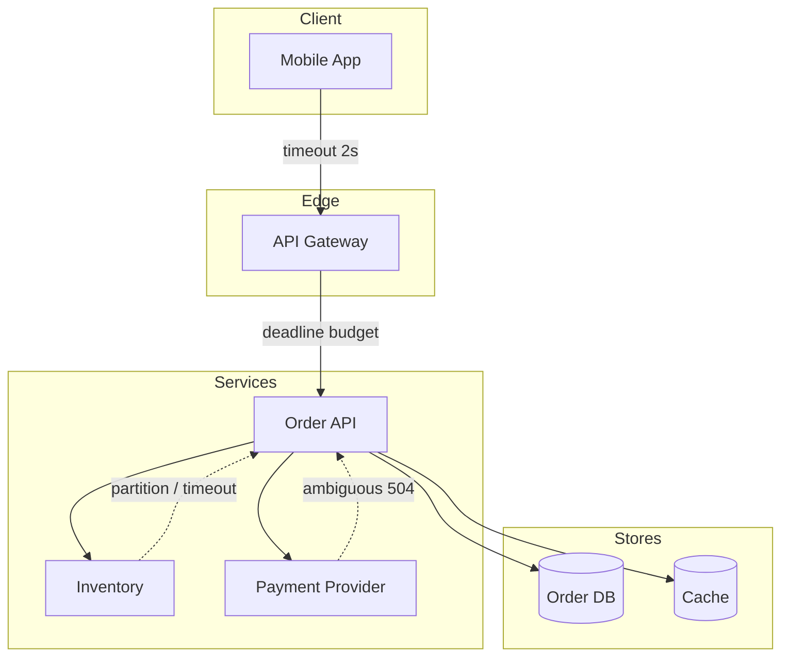

# Distributed Systems — Partial Failure Topology

**Supports decision:** where to place timeouts, retries, and idempotency when every hop can fail independently—not only when the whole machine is down.

