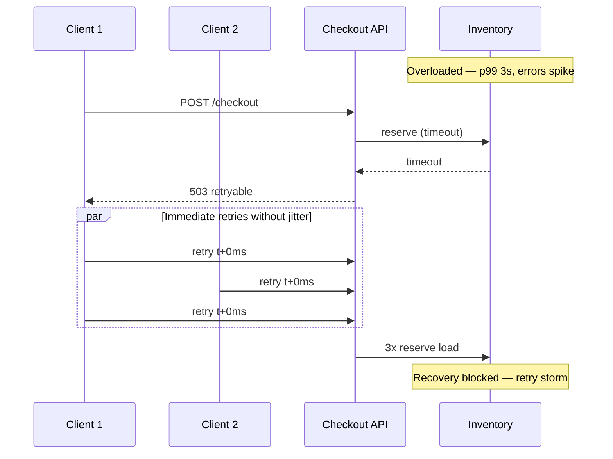

# Retry Amplification — Thundering Herd

**Supports decision:** whether retries are safe (idempotent), capped, jittered, and coordinated—or they multiply load during an outage.

```mermaid
sequenceDiagram
  participant C1 as Client 1
  participant C2 as Client 2
  participant API as Checkout API
  participant Inv as Inventory

  Note over Inv: Overloaded — p99 3s, errors spike

  C1->>API: POST /checkout
  API->>Inv: reserve (timeout)
  Inv-->>API: timeout
  API-->>C1: 503 retryable

  par Immediate retries without jitter
    C1->>API: retry t+0ms
    C2->>API: retry t+0ms
    C1->>API: retry t+0ms
  end

  API->>Inv: 3x reserve load
  Note over Inv: Recovery blocked — retry storm
```
