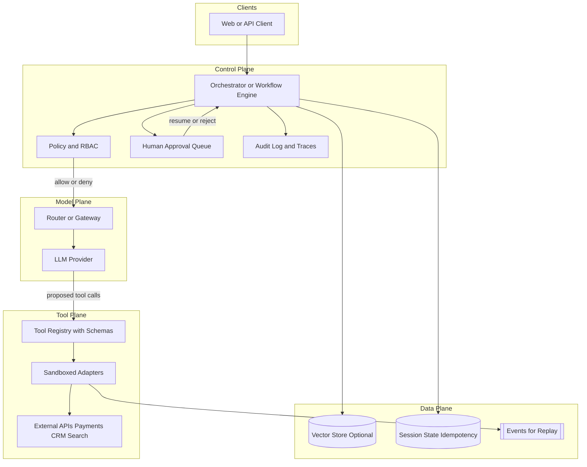

# AI Engineering Fluency — Agent Control Plane Overview

**Supports decision:** Where to place guardrails, state, and human approval so agent workflows stay observable, reversible, and within latency/cost budgets.

**Caption:** The **orchestrator** owns step boundaries, budgets, and retries; the **LLM** proposes actions; **tools** execute only through validated, policy-checked adapters. Human approval sits on **high-blast-radius** branches (refunds, mass email, production config).
