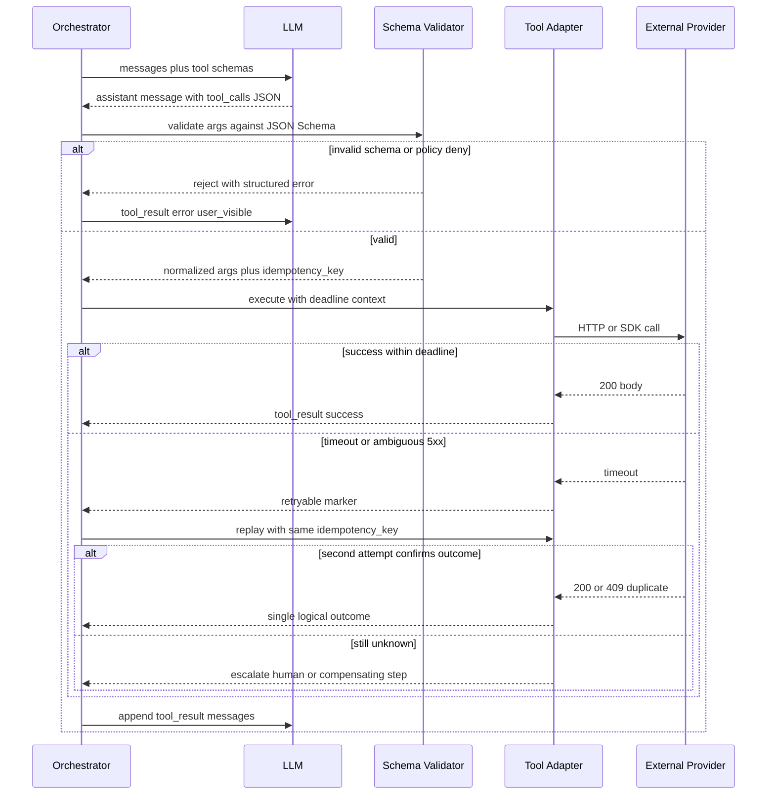

# Tool Invocation — Happy Path, Timeout, and Idempotent Retry

**Supports decision:** How to treat model-proposed tool calls like untrusted RPC: validate, bound time, dedupe replays, and surface partial failure to the user or next step.

**Caption:** Treat **timeouts** as first-class: the model must not assume success; the orchestrator records **idempotency keys** per tool invocation so replays and duplicate LLM proposals do not double-charge or double-email.
