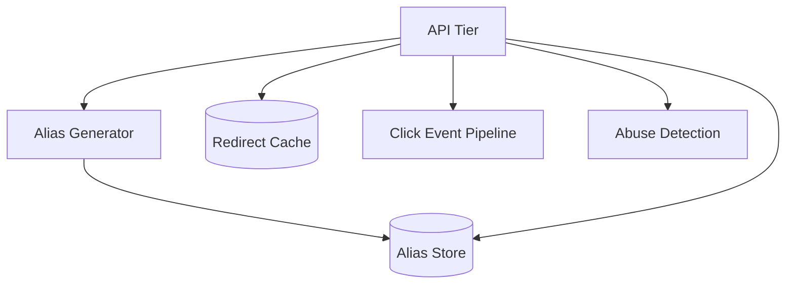

# URL Shortener — Components

**Supports decision:** identify the URL generation, lookup, cache, and analytics components.

```mermaid
flowchart TB
  api[API Tier]
  generator[Alias Generator]
  store[(Alias Store)]
  cache[(Redirect Cache)]
  analytics[Click Event Pipeline]
  abuse[Abuse Detection]

  api --> generator
  generator --> store
  api --> cache
  api --> store
  api --> analytics
  api --> abuse
```