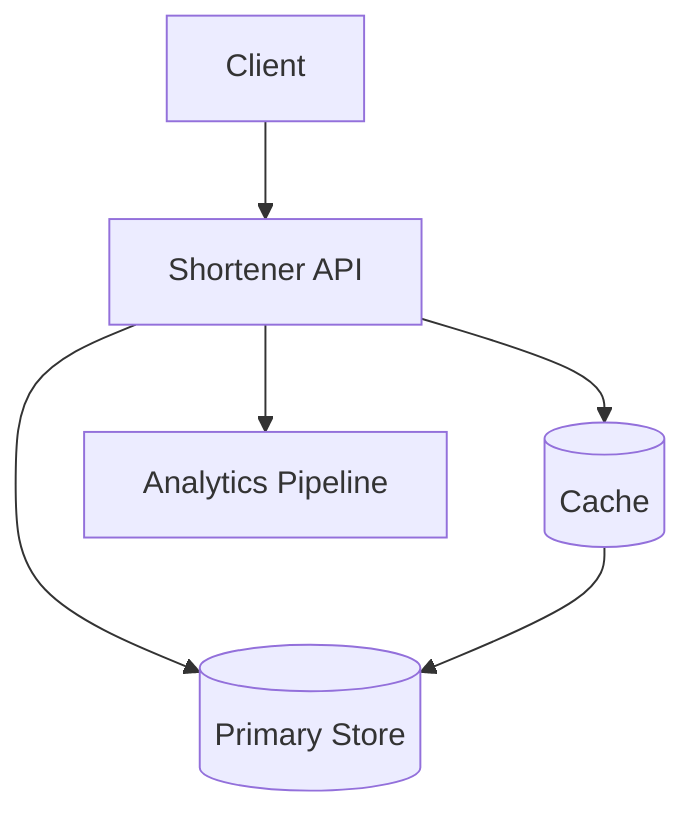

# URL Shortener — Context

**Supports decision:** show the short URL service interactions with clients, storage, cache, and analytics.

```mermaid
flowchart TB
  client[Client]
  api[Shortener API]
  cache[(Cache)]
  store[(Primary Store)]
  analytics[Analytics Pipeline]

  client --> api
  api --> cache
  api --> store
  api --> analytics
  cache --> store
```