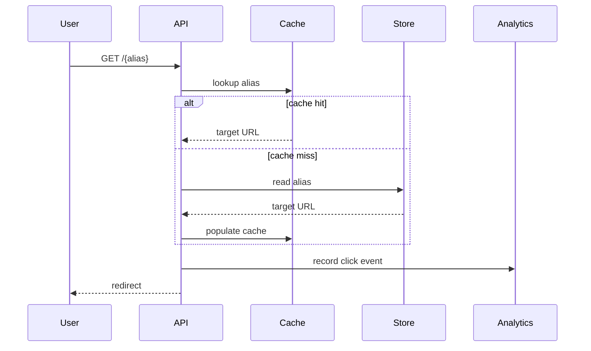

# URL Shortener — Core Flow

**Supports decision:** show the redirect lookup and fallback path for an alias.

```mermaid
sequenceDiagram
  participant U as User
  participant A as API
  participant C as Cache
  participant S as Store
  participant E as Analytics

  U->>A: GET /{alias}
  A->>C: lookup alias
  alt cache hit
    C-->>A: target URL
  else cache miss
    A->>S: read alias
    S-->>A: target URL
    A->>C: populate cache
  end
  A->>E: record click event
  A-->>U: redirect
```