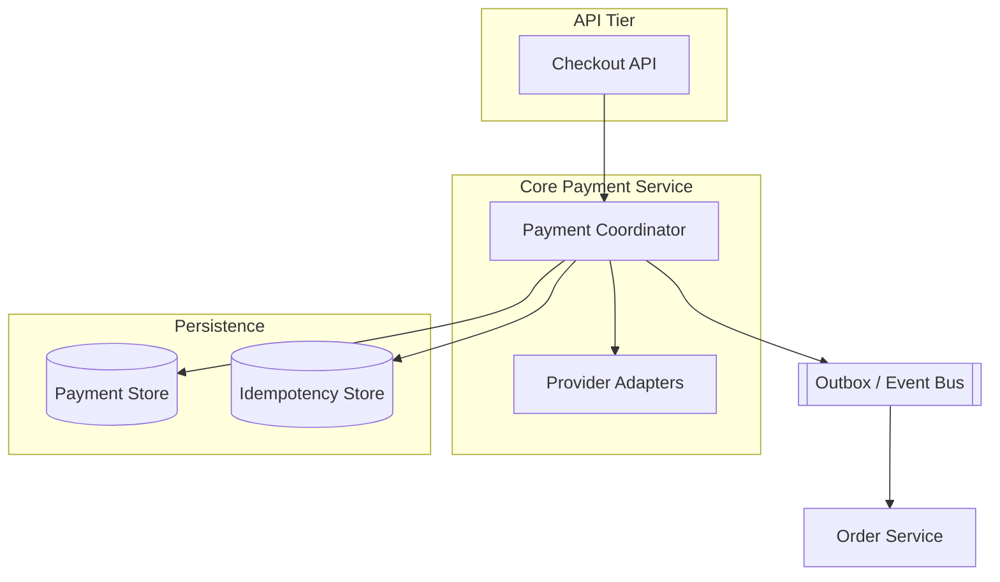

# Payment System — Components

**Supports decision:** identify the key components and persistence boundaries for payment coordination.

```mermaid
flowchart TB
  subgraph api [API Tier]
    checkout[Checkout API]
  end
  subgraph core [Core Payment Service]
    coordinator[Payment Coordinator]
    adapter[Provider Adapters]
  end
  subgraph persistence [Persistence]
    store[(Payment Store)]
    idempotency[(Idempotency Store)]
  end
  outbox[[Outbox / Event Bus]]
  order[Order Service]

  checkout --> coordinator --> adapter
  coordinator --> store
  coordinator --> idempotency
  coordinator --> outbox --> order
```