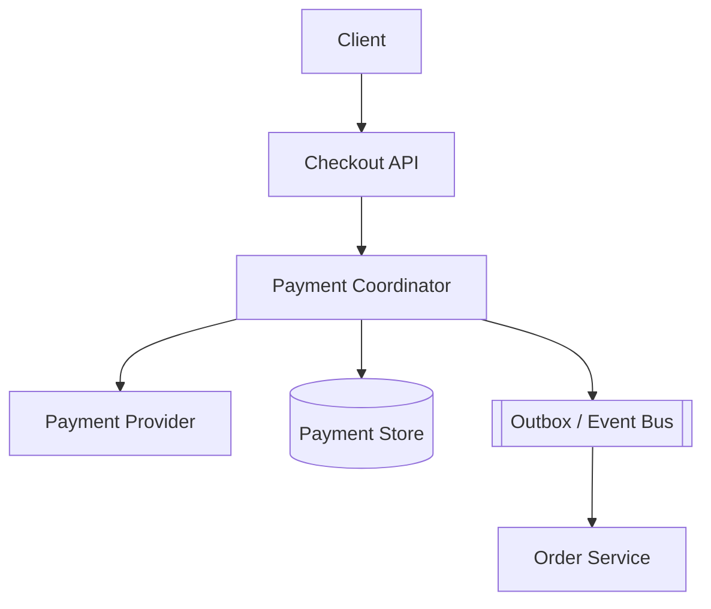

# Payment System — Context

**Supports decision:** show how payment requests, provider adapters, and downstream order systems interact.

```mermaid
flowchart TB
  client[Client]
  api[Checkout API]
  coordinator[Payment Coordinator]
  provider[Payment Provider]
  store[(Payment Store)]
  outbox[[Outbox / Event Bus]]
  order[Order Service]

  client --> api --> coordinator
  coordinator --> provider
  coordinator --> store
  coordinator --> outbox --> order
```