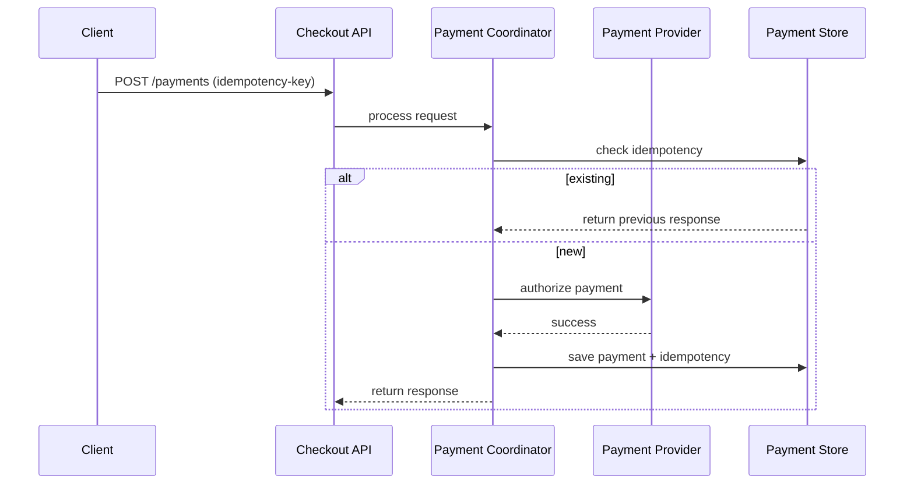

# Payment System — Core Flow

**Supports decision:** describe the happy path for an idempotent payment request.

```mermaid
sequenceDiagram
  participant C as Client
  participant API as Checkout API
  participant PC as Payment Coordinator
  participant P as Payment Provider
  participant S as Payment Store

  C->>API: POST /payments (idempotency-key)
  API->>PC: process request
  PC->>S: check idempotency
  alt existing
    S-->>PC: return previous response
  else new
    PC->>P: authorize payment
    P-->>PC: success
    PC->>S: save payment + idempotency
    PC-->>API: return response
  end
```