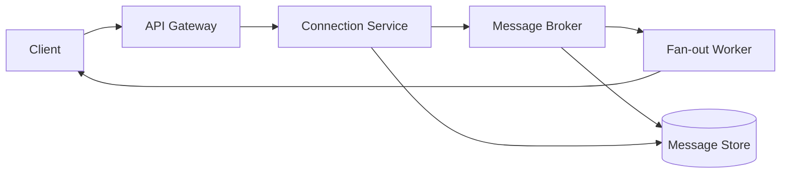

# Chat System

A chat system must deliver messages in near real time, preserve ordering within conversations, and support presence and history retrieval. The design balances mobile client connectivity, fan-out scale, and eventual consistency for message persistence.

## Problem framing

- **Users:** app users, web clients, bot services
- **Peak load:** ~50k concurrent rooms, 10M messages per hour
- **Critical path:** deliver messages to active clients in <100ms
- **Business goals:** reliable delivery, consistent ordering, graceful reconnect/replay

## Requirements

- Send and receive messages in chat rooms or direct conversations
- Maintain participant presence and connection state
- Persist message history for replay and search
- Support read receipts, typing indicators, and durable notification
- Scale across regions and support mobile clients with intermittent network

## Key constraints

- Fan-out for busy rooms may be extremely high
- Ordering is important per room/channel but can be weak globally
- Active clients may disconnect and resync frequently
- Message persistence can be eventually consistent behind live delivery
- Resource limits on open WebSocket connections and per-user fan-out

## Architecture overview

- **API gateway** accepts client connections over WebSocket or HTTP
- **Connection service** tracks presence and routes messages to active sessions
- **Message broker** publishes chat events to room/topic subscribers
- **Storage layer** persists chat events and conversation state
- **Fan-out workers** deliver messages to clients and compute offline notifications

## API sketch

| Method | Path / Event | Notes |
|--------|--------------|-------|
| WS | /connect | Upgrade to WebSocket, authenticate, join rooms |
| POST | /rooms/{id}/messages | Publish message to room |
| GET | /rooms/{id}/history | Retrieve recent messages |
| GET | /presence/{roomId} | Get current participant list |

## Data model

- `Message`
  - `messageId`
  - `roomId`
  - `senderId`
  - `body`
  - `createdAt`
  - `sequenceNumber`
  - `metadata`

- `RoomState`
  - `roomId`
  - `participantIds`
  - `lastMessageTimestamp`
  - `orderingPolicy`

- `PresenceRecord`
  - `userId`
  - `connectionId`
  - `roomId`
  - `status`
  - `lastSeen`

## Diagrams

- [Context diagram](./diagrams/context.md)
- [Components diagram](./diagrams/components.md)
- [Core flow diagram](./diagrams/core-flow.md)

## Reliability and failure modes

- **Hot room fan-out:** scale with partitioned publish/subscribe and sharded delivery workers
- **Disconnected clients:** keep a replay buffer and allow catch-up on reconnect
- **Message reorder:** attach sequence numbers and use per-room order buffering
- **Lost events in broker:** use persistence in the broker or durable log-backed queue
- **Slow clients:** backpressure or drop non-critical presence updates to keep live traffic moving

## Diagram

## If I had two more weeks

- Add offline message sync and read receipt reconciliation
- Build typed room policies and role-based access control
- Add search and threaded conversation support

## Three scale triggers

1. **Room hot-spots** → move to room-level partitioning and dedicated fans
2. **Regionally distributed users** → deploy regionally and replicate history asynchronously
3. **Bursty reconnect storms** → gate reconnection with backoff and session token reuse

## Interview prompts

- How do you preserve ordering while scaling an active chat room?
- What are the trade-offs between push-based and poll-based delivery?
- How would you avoid a single hot room overwhelming your broker and workers?
