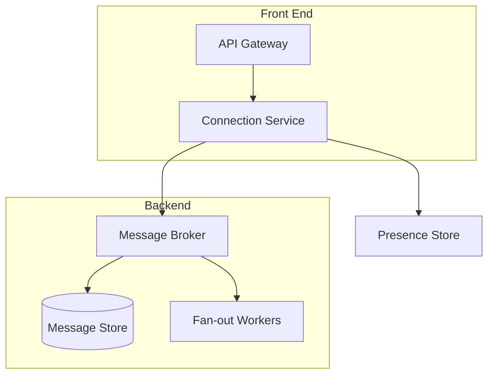

# Chat System — Components

**Supports decision:** identify the services responsible for presence, routing, and persistence.

```mermaid
flowchart TB
  subgraph front [Front End]
    gateway[API Gateway]
    connection[Connection Service]
  end
  subgraph backend [Backend]
    broker[Message Broker]
    history[(Message Store)]
    fanout[Fan-out Workers]
  end
  presence[Presence Store]

  gateway --> connection
  connection --> broker
  broker --> history
  broker --> fanout
  connection --> presence
```