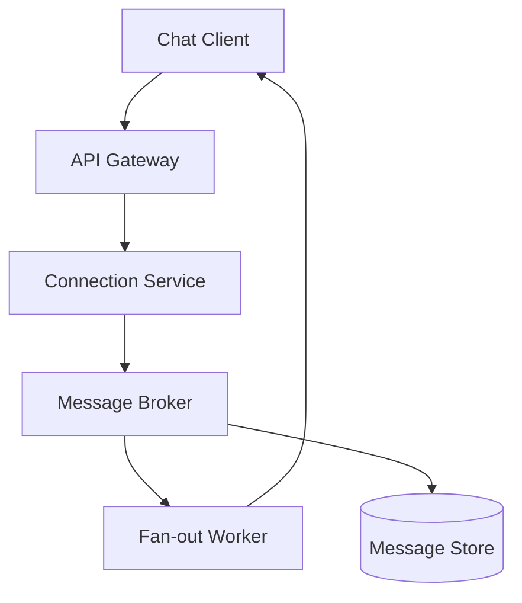

# Chat System — Context

**Supports decision:** show client connections, message routing, and storage boundaries.

```mermaid
flowchart TB
  client[Chat Client]
  gateway[API Gateway]
  conn[Connection Service]
  broker[Message Broker]
  store[(Message Store)]
  worker[Fan-out Worker]

  client --> gateway --> conn
  conn --> broker
  broker --> worker
  broker --> store
  worker --> client
```