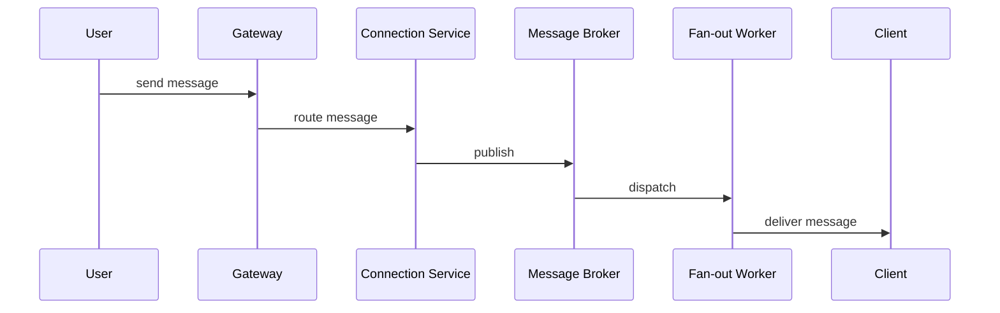

# Chat System — Core Flow

**Supports decision:** document the happy path for publishing a chat message and delivering it to active clients.

```mermaid
sequenceDiagram
  participant U as User
  participant GS as Gateway
  participant CS as Connection Service
  participant MB as Message Broker
  participant FW as Fan-out Worker
  participant C as Client

  U->>GS: send message
  GS->>CS: route message
  CS->>MB: publish
  MB->>FW: dispatch
  FW->>C: deliver message
```