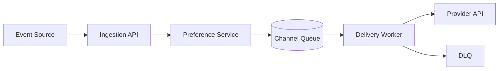

# Notification System

A notification system must reliably deliver messages across channels, respect user preferences and throttles, and support retry semantics for transient failures. It should decouple event ingestion from downstream delivery while preserving message ordering where required.

## Problem framing

- **Users:** customers, support teams, apps, operations
- **Peak load:** ~500k notifications per minute, bursty campaign spikes
- **Critical path:** accept notification requests quickly and ensure eventual delivery
- **Business goals:** high delivery success, low duplicate notifications, channel-specific retries

## Requirements

- Ingest notification requests for email, SMS, and push channels
- Support user preferences, do-not-disturb, and opt-out lists
- Retry transient failures and route permanent failures to a DLQ
- Maintain per-recipient dedupe and throttle rate limits
- Provide status tracking and some delivery analytics

## Key constraints

- Channel providers have different SLAs and error semantics
- User preferences must be evaluated before sending
- Backpressure from slow providers must not block ingestion
- Duplicate notification risk increases during retries and transient failures
- Campaign bursts can saturate provider quotas and network bandwidth

## Architecture overview

- **Ingestion API** accepts notifications and validates recipients.
- **Preference service** resolves channel rules and throttles.
- **Queueing layer** buffers delivery requests for each channel.
- **Delivery workers** call provider adapters and emit status events.
- **Dead-letter queue** captures permanent failures for manual review.

## API sketch

| Method | Path | Notes |
|--------|------|-------|
| POST | /notifications | Create a notification request |
| GET | /notifications/{id}/status | Get delivery status |
| POST | /users/{id}/preferences | Update notification settings |

## Data model

- `NotificationRequest`
  - `requestId`
  - `recipientId`
  - `channel`
  - `payload`
  - `priority`
  - `createdAt`
  - `status`

- `Preference`
  - `recipientId`
  - `channels`
  - `quietWindow`
  - `optOut`
  - `frequencyCap`

- `DeliveryEvent`
  - `eventId`
  - `requestId`
  - `providerResponse`
  - `attempt`
  - `status`
  - `timestamp`

## Diagrams

- [Context diagram](./diagrams/context.md)
- [Components diagram](./diagrams/components.md)
- [Core flow diagram](./diagrams/core-flow.md)

## Reliability and failure modes

- **Slow provider backlog:** separate queues per channel and priority; apply circuit breakers
- **Duplicate delivery:** use dedupe key and ensure idempotent notifications at provider adapter
- **Preference logic errors:** make preference evaluation a separate, testable service
- **DLQ saturation:** monitor dead-letter volume and expose manual triage workflows
- **Channel quota limits:** fallback to alternative channel or delay delivery until quota resets

## Diagram

## If I had two more weeks

- Add adaptive channel selection with fallbacks
- Build a notification simulator for campaigns and edge-case bursts
- Add richer analytics for delivery latency and provider reliability

## Three scale triggers

1. **Campaign spikes** → add priority lanes and smoothing to queue processing
2. **Provider errors rise** → add multi-provider failover and circuit breaker patterns
3. **Personalization grows** → shard preference service and cache user settings aggressively

## Interview prompts

- Why separate ingestion from delivery in a notification system?
- How do you avoid sending duplicates across retries and transient failures?
- What are the main failure modes for multi-channel delivery and how do you detect them?
