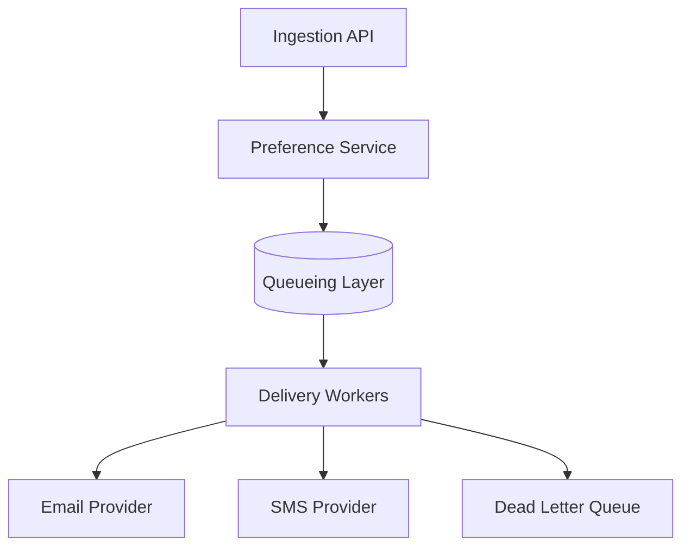

# Notification System — Components

**Supports decision:** highlight the preference, queue, and delivery components for multi-channel messaging.

```mermaid
flowchart TB
  api[Ingestion API]
  prefs[Preference Service]
  queue[(Queueing Layer)]
  worker[Delivery Workers]
  providerA[Email Provider]
  providerB[SMS Provider]
  dlq[Dead Letter Queue]

  api --> prefs --> queue
  queue --> worker
  worker --> providerA
  worker --> providerB
  worker --> dlq
```